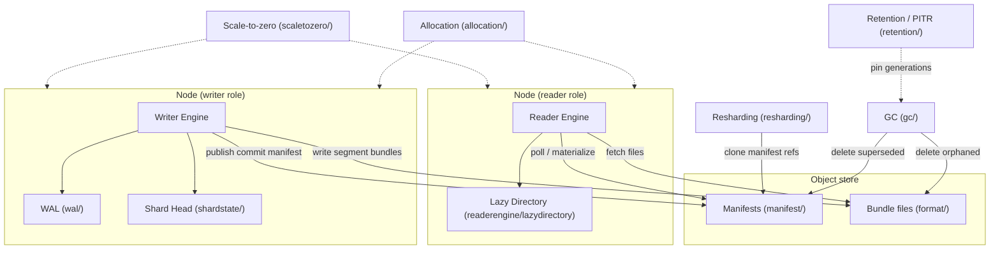

## Component map

## Components

| Package | Responsibility |
|---|---|
| `writerengine/` | Object-store-native writer engine. Owns local Lucene commits, publishes commit manifests, coordinates with the WAL for durability between commits. `ObjectStoreWriterEngine`, `WriterEngineFactory`, `ObjectStoreCommitPublisher`, `ObjectStoreCommitHeadPublisher`. |
| `readerengine/` | Read-only engine that materializes a search-only shard copy from published manifests. `ObjectStoreReaderEngine`, `ReaderEngineFactory`, `ReaderShardAdmissionController`. Its `lazydirectory/` subpackage does searchable-snapshot-style lazy file fetch instead of eager full-bundle download. |
| `wal/` | Node-level write-ahead log: chunk format, group-commit/batching, replay recovery, chunk GC. `WalChunkService`, `WalBatchingProcessor`, `WalReplayRecovery`, `WalGcSchedulerTask`. |
| `manifest/` | Commit manifests — the unit of visibility for one Lucene commit in object-store form. `CommitManifest`, `BlobContainerManifestStore`. |
| `format/` | Segment bundle wire format: packs a commit's Lucene files into one blob, with local-disk caching in front of it. `BlobContainerBundleStore`, `LocalDiskCachingBundleStore`, `BundleWriter`/`BundleReader`. |
| `gc/` | Decides which superseded manifests and orphaned bundles are safe to delete. `GcSchedulerTask`, `ManifestRetentionPolicy`, `BundleReferenceCounter`. |
| `retention/` | Durable pins (snapshots, PITR) that keep specific manifest generations alive regardless of normal GC. `DurablePinRegistry`, `PitrRetentionPolicy`, `PitrRetentionReconciler`. |
| `resharding/` | Zero-copy shard split into N partitions without rewriting bundle bytes; reader-side doc-routing filter; background physical rewrite; shrink (a split's two children merging back); in-place auto-split/auto-merge triggers. `ShardSplitter`, `ShardShrinker`, `InPlaceSplitTriggerCoordinator`, `PartitionFilteringDirectoryReader`. |
| `scaletozero/` | Cluster-wide idle-candidate policy evaluation and suspension. `ScaleToZeroCandidatesSchedulerTask`, `ShardSuspensionCoordinator`, `ShardReactivationActionFilter`. |
| `scaleup/` | Reader-replica expansion under read load. `ScaleUpCandidatesSchedulerTask`, `ReaderReplicaExpansionCoordinator`. |
| `allocation/` | Reader/writer node-role placement deciders, no-peer-recovery allocation, suspended-shard handling. `ServerlessStorageExistingShardsAllocator`, `ReaderShardPlacementAllocationDecider`, `SuspendedShardAllocationDecider`. |
| `shardstate/` | `ShardHead` — the linearizable coordination primitive writer, reader, and GC all rely on, mutated only via compare-and-swap. |
| `directory/` | Shard directory abstraction and consistent-hash routing for partitioned views. |
| `security/` | AES-GCM encryption of blobs, per-index key provider, request-counting/restricting blob container wrappers. |
| `compaction/` | Lucene-merge-based rebase/compaction publisher and scheduler. |
| `clone/` | Shard cloning via lineage tracking — the primitive both resharding and migration build on. |
| `migration/` | Migrating classic-engine indices onto this engine. |
| `translog/` | `WalMirroringTranslog` — mirrors ordinary translog writes into the object-store WAL. |

## `ShardHead`: the coordination primitive

Almost every other component reads or CAS-mutates `ShardHead`. It tracks, per shard:

- **`primaryTerm`** — advances only on a real publish (a commit that actually lands).
- **`leaseTerm`** — advances immediately when any node acquires or renews the writer lease, even before it publishes anything. This is distinct from `primaryTerm` specifically to close a split-brain window: a partitioned former primary could otherwise keep publishing under a stale term because nothing else had advanced yet. Fencing checks compare against `leaseTerm`, not `primaryTerm`. See [Plugin Fixes](/plugin-fixes/) for the fix that introduced this.
- **`leaseHolderNodeId`**, **`leaseExpiryMillis`** — who currently holds the write lease and until when.
- **`latestManifestGeneration`** — the generation number of the most recently published manifest.

Every mutation goes through compare-and-swap against the object store's conditional-write support, so two nodes racing to publish or acquire the lease can't both succeed.
