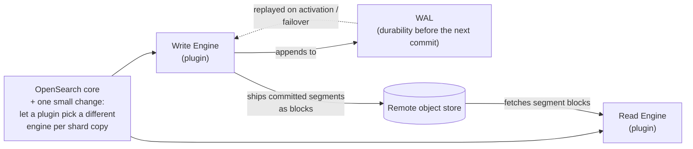
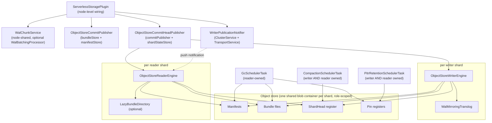

## The core idea

Two things had to happen to build this: a **small hook added to OpenSearch core**, and a **plugin** that uses that hook to split one shard's engine into a writer half and a reader half, both talking to a remote object store instead of relying on local disk as the source of truth.

- **The core change** is narrow and specific: today, a plugin picks one `Engine` implementation for an entire index, decided once. This plugin needs two different engines *for the same index* — one for the shard copy that accepts writes, another for copies that only serve search. Core's one addition is letting a plugin's engine choice depend on which shard copy is being created, not just which index — see [Core Changes](/core-changes/) for the exact seam.
- **The write engine** behaves like the classic engine (same Lucene indexing underneath), plus two things: it appends every write to a **WAL** first, so a crash or failover has something to replay before the next durable commit exists; and on every commit, it packages the resulting segment files into a **block** and ships that block to the remote object store, along with a small pointer record saying "this is now the current version."
- **The read engine** never indexes anything. It watches the object store for a newer version pointer and fetches the segment blocks it doesn't already have — that's its entire job. Because it has no local state that didn't come from the object store, it can be started, stopped, or moved to another node freely.
- **The object store is the actual source of truth.** Local disk on either engine is a cache/workspace, not the durable copy — that's what makes scale-to-zero, cheap resharding, and moving shards between nodes possible without the usual peer-recovery machinery. See [Remote Store Data Model](/design/remote-store-data-model/) for exactly what's stored there, its lifecycle, and how the plugin keeps object-store API cost down.

## Component ownership graph

The layered view above shows the *shape*; this shows the actual object graph — who constructs and owns whom, at a finer grain (not a request-flow diagram — see [Flows](/flows/core-sequences/) for those):

## Package inventory

| Package | Responsibility | Deep dive |
|---|---|---|
| `shardstate/` | `ShardHead` — the linearizable coordination primitive everything else CAS-mutates or reads. No in-process locks anywhere in this package. | [Coordination & Consistency](/design/coordination/) |
| `writerengine/` | `ObjectStoreWriterEngine` (owns local Lucene commits + WAL coordination + publish), `ObjectStoreCommitPublisher` (packaging), `ObjectStoreCommitHeadPublisher` (fencing), `WriterPublicationNotifier` (push notification). | [Writer Engine & WAL](/design/writer-engine/) |
| `readerengine/` | `ObjectStoreReaderEngine` — materializes a search-only shard from published manifests. `lazydirectory/` does per-file, on-demand fetch instead of eager full-bundle download. | [Reader Engine & Materialization](/design/reader-engine/) |
| `wal/` | Node-shared write-ahead log: chunk format, chunk-sequence CAS allocator, group-commit/batching, replay recovery, chunk GC. | [Writer Engine & WAL](/design/writer-engine/) |
| `translog/` | `WalMirroringTranslog` — a `LocalTranslog` subclass that mirrors every local translog append into the WAL. | [Writer Engine & WAL](/design/writer-engine/) |
| `manifest/` | `CommitManifest` — the unit of visibility for one Lucene commit in object-store form, plus `WalPosition` (the WAL-replay durability bound a manifest carries) and `BlobContainerManifestStore`. | [Writer Engine & WAL](/design/writer-engine/) |
| `format/` | Segment bundle wire format — packs a commit's Lucene files into one blob — plus local-disk ciphertext caching and the node-wide in-memory plaintext cache in front of it. | referenced throughout |
| `gc/` | Decides which superseded manifests and orphaned bundles are safe to delete; a pure decision layer (`ManifestRetentionPolicy`, `BundleReferenceCounter`) plus the scheduled sweep itself. | [GC, Retention & PITR](/design/gc-retention/) |
| `retention/` | Durable pins backing both PITR and the plugin's own snapshot-pin mechanism — the thing that keeps a manifest generation alive regardless of normal GC. | [GC, Retention & PITR](/design/gc-retention/) |
| `resharding/` | Zero-copy split into N partitions, write-partition routing/fencing at the write path, background physical rewrite, and the merge/shrink reverse flow. | [Resharding](/design/resharding/) |
| `scaletozero/` | Idle-candidate evaluation, cluster-state-driven suspension, and request-triggered reactivation. | [Scale-to-Zero & Scale-Up](/design/scale-to-zero-scale-up/) |
| `scaleup/` | Reader-replica-count expansion under read load. | [Scale-to-Zero & Scale-Up](/design/scale-to-zero-scale-up/) |
| `allocation/` | Custom `AllocationDecider`s for reader/writer placement and suspension, plus the `ExistingShardsAllocator` that replaces the meaningless-for-this-engine default gateway allocator. | [Allocation & Placement](/design/allocation/) |
| `directory/` | `ShardDirectory` — cluster-wide "who's serving which shard" discoverability hint. Explicitly never a correctness dependency; only `ShardHead`'s CAS is. | [Coordination & Consistency](/design/coordination/) |
| `security/` | AES-GCM at-rest encryption with independently-authenticated blocks (for cheap ranged reads), per-index key provider, and least-privilege `RestrictingBlobContainer` wrappers scoping delete capability to GC alone. | [Security & Compaction](/design/security-compaction/) |
| `compaction/` | Lucene-merge-based rebase/compaction — proven safe under concurrent writer contention via the same CAS publish protocol, not lease-gated. | [Security & Compaction](/design/security-compaction/) |
| `clone/` | `ShardCloner` — the zero-copy clone primitive both resharding and migration build on; pin-before-read ordering, lineage-chain fallback reads. | [Resharding](/design/resharding/) |
| `migration/` | One-shot, one-directional adoption of a classic-engine shard's current commit into serverless storage. | [Overview](/overview/) |

## What ties it all together

Two primitives recur across nearly every package above, and are each explained exactly once, on [Coordination & Consistency](/design/coordination/):

- **`ShardHead` compare-and-swap** — the sole mechanism by which a writer publishes, a compactor rebases, a clone activates a target, or a migration adopts a shard. No in-process locks; every mutation is a read-check-write CAS retry loop against a blob-store register.
- **Pin-before-read ordering** — the sequencing `ShardCloner`, resharding, and PITR reconciliation all follow identically to avoid a TOCTOU race with GC.
