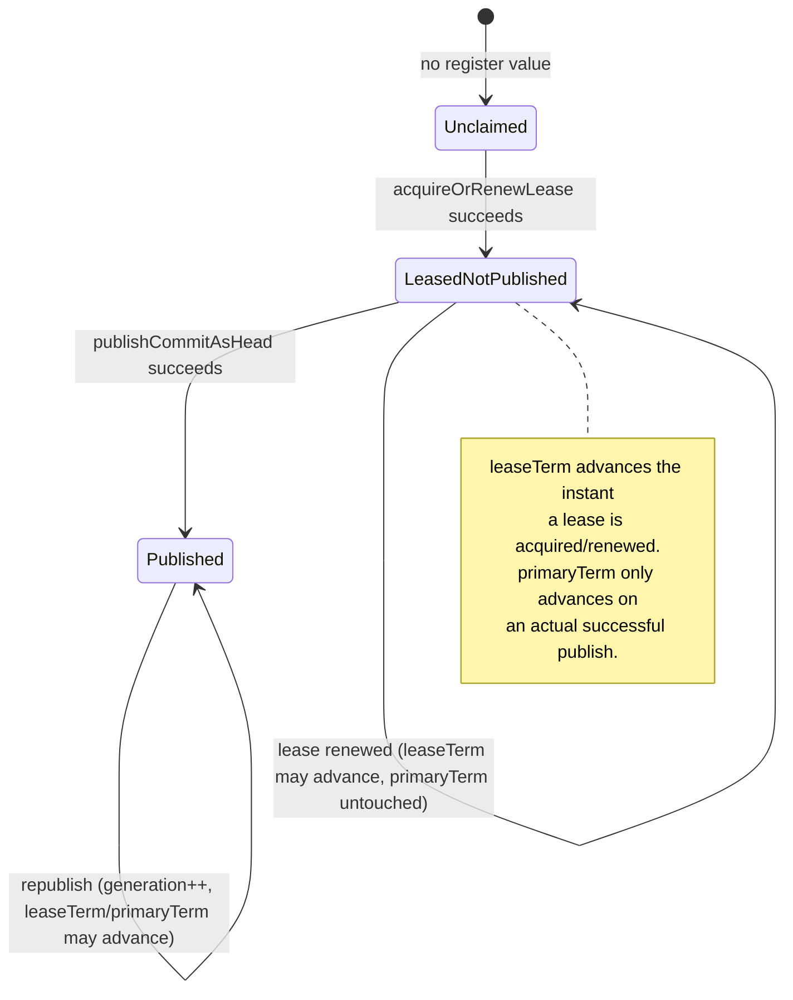

Every subsystem in this plugin that mutates shared state — the writer publishing a commit, a reader materializing it, GC deleting a superseded generation, compaction rebasing segments, a split cloning a target — goes through exactly one coordination primitive: a compare-and-swap over a single small blob per shard, `ShardHead`. There are no in-process locks anywhere in this layer.

## `ShardHead`: the one thing that has to be correct

`ShardHead` is an immutable value type identified by `(indexUuid, shardId)`, holding:

- `primaryTerm` — the term of the *last real publication*. Only ever advances via a successful commit publish.
- `leaseTerm` — the highest term *any node has acquired or renewed the write lease under*, whether or not that node has published anything yet. Advances immediately on lease acquisition/renewal.
- `leaseHolderNodeId`, `leaseExpiryMillis` — who currently holds the write lease and until when.
- `latestManifestGeneration` — the generation number of the most recently published manifest. `0` is the "nothing published yet" sentinel.

The class enforces one invariant everywhere: **`leaseTerm >= primaryTerm`**, always. `ShardHead.initial()` starts at `(primaryTerm=1, leaseTerm=1, generation=0)`.



### Why two term fields, not one

If fencing compared only against `primaryTerm`, a writer that lost the lease to a new node — but hadn't published anything since — would still look "current" by `primaryTerm` alone, because nothing had advanced it yet. A stale, already-superseded writer could keep publishing under its own older term until the new writer's first commit finally landed. `leaseTerm` closes that window: it moves the instant *any* node claims the lease, before that node has done any work, so a superseded writer is fenced out immediately rather than after the new writer's first successful commit.

Every fencing check in this plugin — in both lease acquisition and commit publication — compares the caller's term against `currentHead.leaseTerm()`, never `primaryTerm()`.

## The register: no locks, only CAS

Everything above describes what `ShardHead` means; this is what actually enforces it on disk. `ShardStateStore` (interface) / `BlobContainerShardStateStore` (sole implementation) reads and writes `ShardHead` through `BlobContainer#readRegister`/`compareAndSwapRegister` — the generic conditional-write primitive documented on the [Core Changes](/core-changes/) page. The register name is `"head-" + indexUuid + "-" + shardId`. `BlobContainerShardStateStore` contains no backend-specific logic at all; every provider's native conditional write (S3 `If-Match`, GCS generation preconditions, Azure ETags, or `FsBlobContainer`'s local-file generation counter) backs the same interface uniformly.

`CasResult` is a two-value enum: `SUCCESS` or `VERSION_CONFLICT`. Every CAS user in this plugin follows the identical shape:

```java
for (;;) {
    VersionedShardHead current = shardStateStore.get(indexUuid, shardId).orElse(null);

    // 1. Fence: is this caller's term still valid against the live head?
    if (current != null && current.head().leaseTerm() > callerTerm) {
        return false; // superseded — give up, do not retry under this term
    }

    // 2. Compute the new value FROM THE JUST-READ STATE, never from a cached/local value.
    ShardHead newHead = current == null
        ? new ShardHead(callerTerm, nodeId, leaseExpiryMillis, 0)
        : current.head().withRenewedLease(nodeId, leaseExpiryMillis, callerTerm);

    // 3. Attempt the swap against the version just read.
    Optional<Long> expectedVersion = current == null ? Optional.empty() : Optional.of(current.version());
    if (shardStateStore.compareAndSet(indexUuid, shardId, expectedVersion, newHead) == CasResult.SUCCESS) {
        return true;
    }
    // else: lost the race — someone else updated the head between our read and our write.
    // Loop: re-read the now-current head and recompute from scratch. Never assume the
    // locally cached read is still valid.
}
```

This shape appears, with the computed value swapped out, in: `ObjectStoreCommitHeadPublisher.acquireOrRenewLease` (lease claim), `ObjectStoreCommitHeadPublisher.publishCommitAsHead` (commit publish — generation is *always* `currentHead.latestManifestGeneration() + 1`, live-computed, never derived from a writer's own local Lucene generation counter), `CompactionRebaseExecutor.publish` (compaction rebase), and `ShardCloner.clone`'s put-if-absent activation CAS.

**Never a bounded retry at this layer.** The `for (;;)` loop itself never gives up — bounding real-world retry duration is the caller's job (e.g. the periodic lease-renewal task just tries again next tick; `CompactionRebaseExecutor` does cap its own *outer* attempt count at 5, treating exhaustion as `RebaseResult.exhausted`, wasted work rather than corruption).

## Publish fencing, concretely

The term comparison described above boils down to one check, run at exactly one point: right before a writer publishes a commit as the new head.

```java
// ObjectStoreCommitHeadPublisher.publishCommitAsHead — the writer's per-commit fencing check
if (currentHead != null && currentHead.leaseTerm() > primaryTerm) {
    return false; // this writer has been superseded — do not publish
}
```

A caller that loses this check gets `false` back, not an exception; `ObjectStoreWriterEngine.commitIndexWriter` treats a `false` return as fatal and calls `failEngine(...)` — the local Lucene commit already happened (harmless, orphaned) but the shard stops serving as writer. This is the same mechanism [Writer Engine & WAL](/design/writer-engine/) walks through in the full commit pipeline.

## Durable pins: the second correctness primitive

`DurablePinRegistry` (interface) / `BlobContainerDurablePinRegistry` (implementation) is the other cross-cutting primitive, used by GC-retention exemption, PITR, and every zero-copy clone (which backs both resharding and migration). A shard's whole pin set lives in one register blob (`pins-<indexUuid>-<shardId>`), mutated via the identical read-modify-CAS-retry shape as `ShardHead` (capped at 50 attempts, throwing `IOException` on exhaustion — a pin write failing loudly is preferable to silently not protecting a manifest generation from GC).

**Pin-before-read ordering** is the one pattern worth calling out explicitly, because it's easy to get backwards: `ShardCloner.clone` pins the source's *current* generation **before** reading its manifest, not after. If the order were reversed, a GC sweep could run between the manifest read and the pin write and delete the very generation the clone is about to reference — a real TOCTOU race, closed by pinning first and only then reading. This ordering is formally verified in `formal/CloneGc.tla` and reused identically by split, shrink, and PITR reconciliation; see [Resharding](/design/resharding/) and [GC, Retention & PITR](/design/gc-retention/) for where it's applied, not re-derived.

Pins are read **twice** in a GC sweep — once early, once again immediately before the delete call — to shrink the window between "pin check" and "actual delete" to as few lines as possible (see [GC, Retention & PITR](/design/gc-retention/)).

## What CAS does *not* protect

`ShardDirectory` (the cluster-wide "who's serving which shard" registry used for cache-affinity hints and push-notification routing) is explicitly a discoverability hint, never a correctness dependency — nothing in this plugin depends on its answers being right, only on `ShardHead`'s CAS being right. A stale or wrong `ShardDirectory` entry can cause a wasted RPC or a cold cache; it can never cause a correctness violation, because every actual read/write decision re-derives from `ShardHead` or a manifest, not from directory state.
