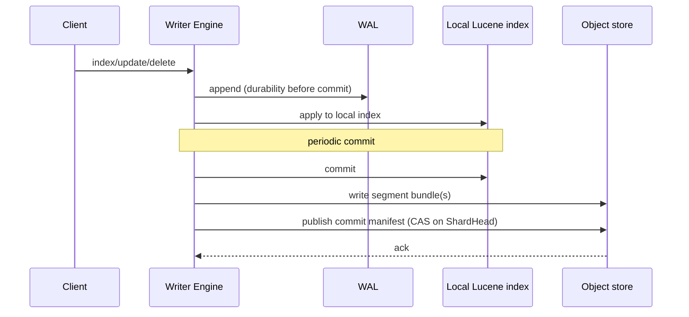
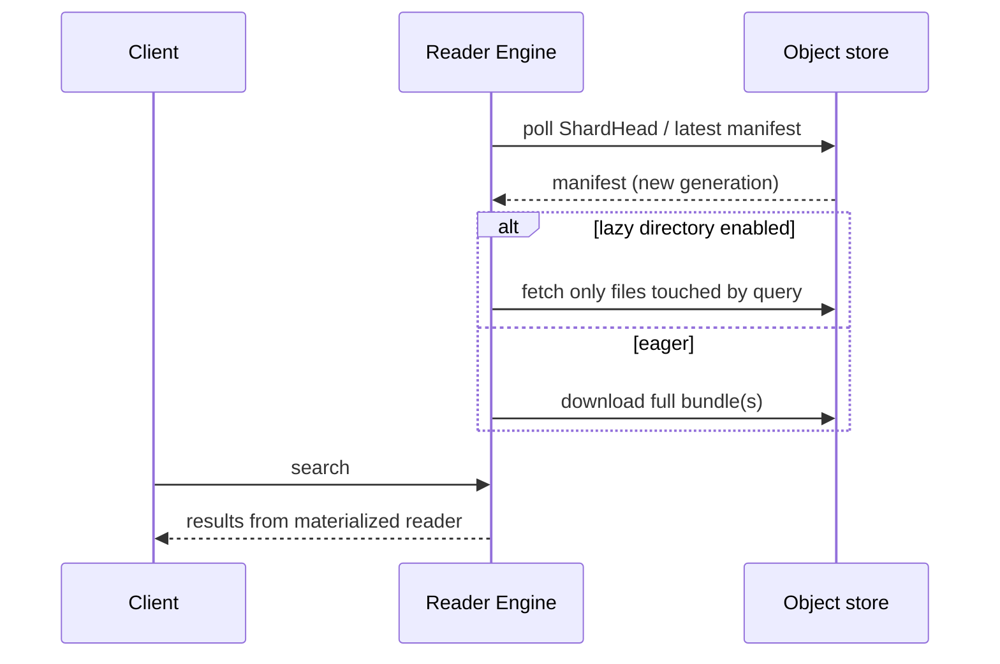
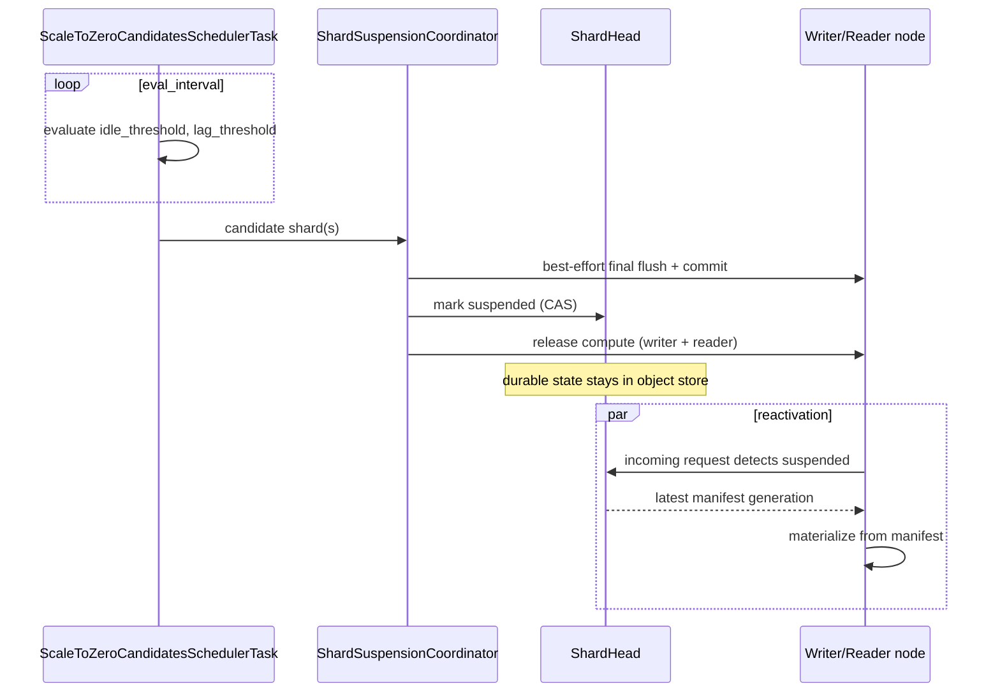
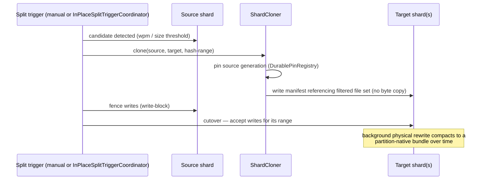
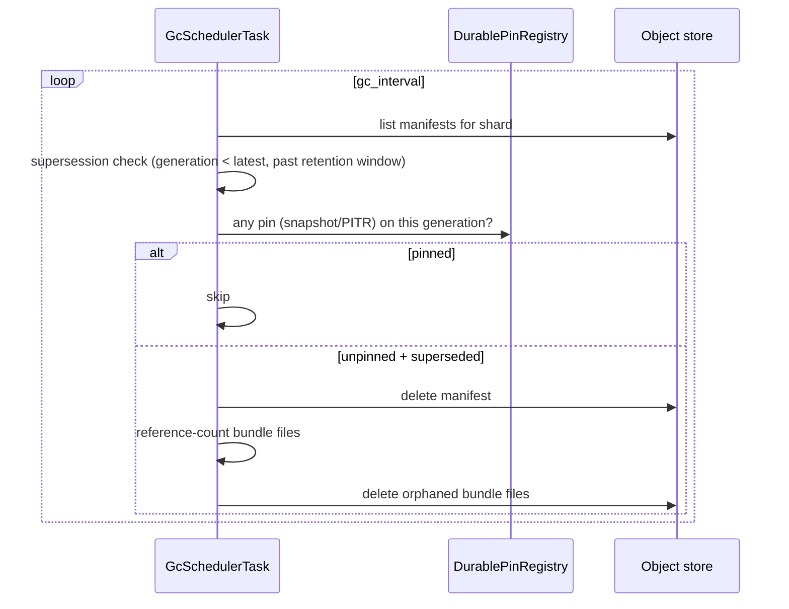

## Write path

A write is durable once the WAL append succeeds, not once the manifest is published — the WAL is what lets a writer recover uncommitted writes after a restart without waiting for the next commit.

## Read path

Reader materialization is independent per reader replica — each one polls and fetches on its own, which is what lets `scaleup/` add reader replicas without coordinating with the writer.

## Scale-to-zero lifecycle

The final flush before suspension is best-effort, not a guarantee — this is safe by design because the durability watermark only advances after a successful publish, so a flush that fails just means the next reactivation replays from one commit earlier via the WAL, not that data is lost.

## Resharding (split)

Splitting is zero-copy at cutover time: a target shard's first manifest references the same underlying bundle files as the source, filtered to its hash range, via `PartitionFilteringDirectoryReader`. The background rewrite that actually removes the now-irrelevant file ranges from disk happens later, off the write-fencing critical path.

Merge (shrink) is the inverse for exactly a split's own two children — their filtered readers fold together via `IndexWriter#addIndexes`, which is why it's cheap; a general N-way merge across unrelated shards is out of scope.

## GC / retention

PITR retention (`retention/`) and GC both run from the writer engine **and** the reader engine — a shard that has scaled to zero on the writer side may still have an active reader, and pins/reconciliation must keep working even when no writer is present. This dual-scheduling was itself a fix made during the broad-scope review; see [Plugin Fixes](/plugin-fixes/).
