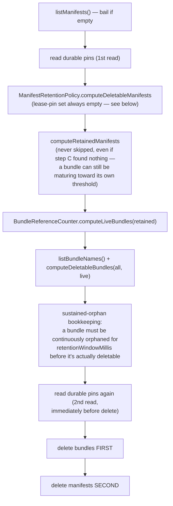

Manifests and bundle files accumulate forever unless something deletes them. `GcSchedulerTask` is that something — one instance per shard, constructed inside `ObjectStoreReaderEngine` only (not the writer engine), because a reader shard outlives a writer scaled to zero and GC needs to keep running regardless of whether a writer currently exists for this shard.

## The sweep, step by step



Two details make this safe under concurrency and crashes:

- **Bundles before manifests.** A crash between the two deletes leaves an orphaned bundle (harmless, GC-eligible on the next sweep) — never a manifest referencing a bundle that no longer exists.
- **Sustained-orphan tracking** (`firstObservedOrphanedAtMillis`, a node-local, non-persistent map) guards against a manifest-list-vs-bundle-list snapshot race: a bundle only becomes deletable once it's been continuously observed as orphaned for the full retention window, not on the first sweep that happens to see it unreferenced.

### The deletability rule

`ManifestRetentionPolicy` (pure, static, no I/O) — a manifest is deletable iff:

```
newerExists && pastRetentionWindow && !leasePinned && !durablyPinned
```

The current-latest manifest can never be deleted, regardless of age. `BundleReferenceCounter` (also pure) computes live bundles as the union of every *retained* manifest's referenced bundles, and deletable bundles as everything known minus that live set — deliberately scoped to one shard's own manifests only. Cross-shard bundle sharing (zero-copy clone) is protected differently: the clone pins the source generation in the *source shard's own* `DurablePinRegistry` at clone time, so a clone-referenced bundle is simply never orphan-eligible in the source's own sweep — see the pin-before-read pattern on [Coordination](/design/coordination/).

### Why lease pins are never a delete-safety signal

The four-condition rule above always passes an empty lease-pin set into `computeDeletableManifests` — lease pins (the node-local `ShardDirectory` hints) are deliberately never consulted for delete safety. Using them would be worse than not checking at all: they'd look like a real check while silently missing every other node's readers, since `ShardDirectory` is explicitly a discoverability hint, not a correctness source (see [Coordination](/design/coordination/)). Only durable, CAS-backed pins — correct cluster-wide regardless of which node evaluates them — are trusted here.

### Two independent tolerances, stacked

The overall GC safety model rests on two things at once: a generous, time-based retention window (bounded comfortably above the 5-second reader manifest-poll lag), and durable pins that are correct cluster-wide. Neither alone would be enough — the retention window alone can't protect a manifest a PITR window or snapshot pin needs kept indefinitely; pins alone, without a grace window, would make every ordinary superseded-generation delete race against poll lag.

## PITR retention

Point-in-time restore needs a manifest from somewhere in the past to still exist, even once ordinary GC would otherwise have reclaimed it. This is the pin logic that keeps one alive for exactly as long as the configured window requires and no longer.

`PitrRetentionPolicy.computeRequiredPins(manifests, nowMillis, windowMillis)` (pure): every manifest with `createdAtMillis >= nowMillis - windowMillis` must stay pinned, **plus** the single latest manifest strictly before that cutoff — so a restore request landing right at the window edge still has something to resolve to. Ties are broken deterministically on `(createdAtMillis, primaryTerm, generation)`, specifically to avoid churn from blob-listing's unordered iteration.

`PitrRetentionReconciler` diffs `requiredPins` against the *currently PITR-tagged* pins only (`PITR_PIN_ID = "pitr"`) — it never touches a snapshot pin that happens to share the same shard — and applies `addPin`/`removePin`. Fully idempotent: safe to call more often than the window actually moves.

### Dual-scheduled: writer and reader both reconcile

Running reconciliation from only the writer created a real gap once shards could scale to zero: `PitrRetentionSchedulerTask` runs from **both** `ObjectStoreWriterEngine` and `ObjectStoreReaderEngine`, each closing its own instance in its own `close()`. This is a deliberate fix, not an accident of wiring — quoting the rationale from the reader engine's own javadoc:

> Previously PITR reconciliation was writer-only, so once a writer scaled to zero, reconciliation silently stopped and whatever was pinned at that instant was retained forever (GC can never delete a durably-pinned manifest). Since a reader shard outlives writer scale-to-zero, it must independently keep reconciling. Running both redundantly is safe — every reconcile call is idempotent.

`PitrRetentionConfig` (a validated record: manifest store, pin registry, window) is deliberately built exactly once in `ServerlessStoragePlugin.getEngineFactory`, **before** the reader/writer role branch, precisely so both branches construct their own scheduler task from the identical config rather than two configs that could drift.

Failures here are logged at `warn`, unlike GC's fully silent swallow — a persistently failing PITR reconcile has no other visible signal, so it gets one.
