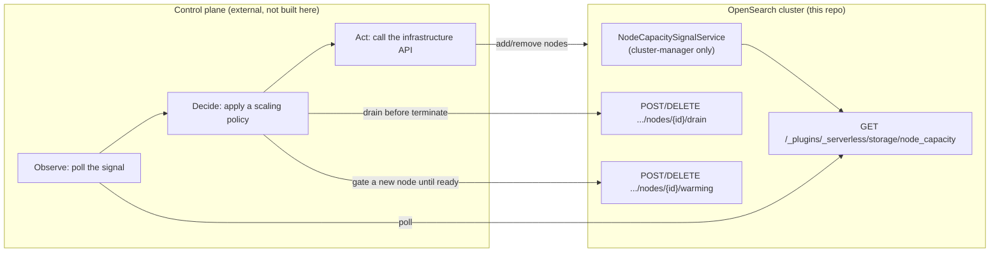

Everything this plugin does today — suspension, reactivation, reader-replica expansion, allocation deciders — redistributes shard copies among nodes that *already exist*. Nothing decides how many writer- or reader-tagged nodes should exist in the first place. A cluster that gets busier than its current node count can serve just runs out of room; a cluster that's been idle for hours keeps paying for the same fleet it needed at peak.

## Why this isn't a plugin problem

It's tempting to reach for a plugin-side fix, since the plugin already reads shard-level load. It can't be one. Adding or removing a node means calling out to infrastructure this plugin has no relationship with — a Kubernetes API, a cloud provider's autoscaling group, a bare-metal provisioning system — and that call differs by deployment in ways an OpenSearch plugin has no business knowing about. Nothing in this codebase talks to any of that today, and it shouldn't start: baking a cloud SDK into the plugin would tie every deployment to whichever infrastructure the plugin's author had in mind, and would hand an OpenSearch process the ability to spend money and destroy machines — a blast radius no plugin here has ever had.

So node autoscaling is fundamentally **a control plane's job**, running outside the cluster, watching it, and deciding when to add or remove capacity. That control plane doesn't exist in this repository and isn't meant to. What *is* in this repository is everything that control plane needs in order to make good decisions and act safely — the plugin's job is to be a trustworthy source of signal and a safe target for action, nothing more.

## What the plugin provides

Three things, all shipped, all off by default:

1. **A truthful capacity signal.** One endpoint reporting, per role (writer and reader pool separately), whether the fleet currently has room to grow into and which nodes are genuinely idle enough to shrink out of. This replaces proxy metrics like CPU with the thing that actually matters: can allocation place a shard copy right now or not.
2. **A safe way to remove a node.** Draining a node redirects future shard placement away from it and reports back once it's truly empty, without ever force-evicting live traffic. Reversible at any point.
3. **A safe way to introduce a node.** A warmup gate holds a freshly-joined node out of shard placement until something says it's ready — an in-repo task self-marks the node the moment it joins, closing the race where nothing has marked it yet, and clearing the mark is the control plane's (or an operator's) call, so a node never starts serving cold.

Everything else — deciding *how many* nodes should exist, calling the infrastructure API, choosing how aggressively to react — is the control plane's to build. The rest of this page describes those three pieces in enough detail to build against them, then the shape of the control plane that consumes them, then the considerations that make the difference between a control plane that works and one that thrashes the fleet or serves cold reads.

## How autoscaling works, end to end



The loop is observe → decide → act, repeated on an interval:

1. **Observe**: poll `GET .../node_capacity`. This is the only source of truth the control plane needs — no separate metrics system, no shadow model of shard state to keep in sync.
2. **Decide**: apply a policy to what was observed — is either role's pool short on capacity, or does it have nodes sitting idle long enough to be worth removing? "Key considerations" below covers what a policy needs to get right to avoid cold starts and fleet thrash.
3. **Act**: call the infrastructure API to add nodes, or drain-then-terminate to remove them, and use the warmup gate so a new node doesn't serve its first queries cold.

The plugin never initiates any of this. It answers when polled and acts when told to drain or warm a specific node — a **pull model**, not a push. That keeps every cloud-specific decision on the control-plane side of the boundary, and it's why the drain and warmup mechanisms are both reversible: the control plane is expected to change its mind mid-sequence when load shifts underneath it.

## The signal: what it reports and why

```
GET /_plugins/_serverless/storage/node_capacity
```

```json
{
  "reader": {
    "node_count": 4,
    "unassigned_shard_count": 3,
    "nodes": [
      {
        "node_id": "abc",
        "node_name": "reader-2",
        "assigned_shard_count": 7,
        "all_shards_idle": false,
        "idle_shard_count": 2,
        "hot_affinity_shard_count": 5,
        "draining": false
      }
    ],
    "drain_candidates": ["def"],
    "sustained_pressure_ticks": 4,
    "unassigned_by_index": { "my-index": 3 }
  },
  "writer": { "...same shape..." }
}
```

Writer and reader pools are reported independently, because they scale on different signals and different timescales — an idle-write, busy-read index (or the reverse) is the common case here, not an edge case.

- **`unassigned_shard_count`** is the scale-up signal: shard copies allocation wants to place for this role but can't (`NO_VALID_SHARD_COPY` — no decider-approved node with room). It's a direct statement of "out of capacity," not an inference from CPU or memory.
- **`all_shards_idle`** (per node) is the scale-down signal, deliberately not an average: a node holding one hot shard and six idle ones must never read as drainable just because its mean load looks low.
- **`hot_affinity_shard_count`** feeds drain *selection* — given several drainable nodes, prefer removing the one fewer warm caches currently point back at.
- **`drain_candidates`** are nodes that have already passed in-cluster idleness hysteresis (sustained across consecutive ticks, not a single low reading) — a pre-filter for the control plane's own policy, not a command to act on immediately.
- **`sustained_pressure_ticks`** lets the control plane tell a transient placement hiccup from real, sustained demand without keeping its own history.
- **`unassigned_by_index`** breaks the scale-up signal down by index, so an operator (or a future control-plane policy) can see which tenant is actually driving fleet growth.

This is computed by `NodeCapacitySignalService`, a cluster-manager-only scheduled task (only one node needs to run this) that reuses the exact same per-shard idle/candidate evaluation `ScaleToZeroCandidatesSchedulerTask` already runs — there's deliberately no second definition of "idle" to drift out of sync with the existing one. The endpoint always serves a cached result; polling it never triggers fresh cluster work, so an aggressive poller can't accidentally load the cluster.

## Draining a node

```
POST   /_plugins/_serverless/storage/nodes/{nodeId}/drain
DELETE /_plugins/_serverless/storage/nodes/{nodeId}/drain   (cancel)
```

Removing a node safely means redirecting placement away from it, letting its existing shards leave on their own schedule, and only then treating it as safe to terminate — never yanking a node out from under live traffic. Drain wraps core's own `cluster.routing.allocation.exclude._name` mechanism to do this, rather than inventing new allocator logic:

1. **Mark**: the node's name goes into the exclude setting, and the drain (with a timestamp) is recorded in cluster state, so it shows up in the signal and survives a cluster-manager failover.
2. **Evacuate**: existing allocation machinery does the work — the exclude setting makes deciders return `NO` from `canRemain`, so started shards relocate elsewhere, and idle ones get suspended by scale-to-zero on its own schedule. Nothing is force-evicted; a draining node with a hot shard keeps serving it until relocation finishes.
3. **Report**: `draining: true` and `assigned_shard_count` show up in the signal for that node. **Zero assigned shards is the only condition under which termination is safe** — never terminate on a timeout alone.
4. **Cancel**: removes the exclude entry and the drain record. This needs to be cheap and instant, because the grace-period pattern below depends on the control plane being able to change its mind mid-drain.

Both directions are idempotent — draining an already-draining node, or cancelling a drain that isn't active, are no-op successes, because the control plane will crash and retry. A background sweep also removes any exclude-list entry with no matching live node and no active drain record, so a departed node's name can never silently poison a future node that reuses it.

One correctness note specific to writer nodes: a writer shard's durability already survives an *ungraceful* eviction today (a failed final flush never advances the durability watermark, and WAL replay covers the gap — see [Scale-to-Zero & Scale-Up](/design/scale-to-zero-scale-up/)). Drain-then-terminate is strictly safer than that existing path, since it waits for a clean handoff first.

## Warming up a node before it serves

A node that joins the cluster and immediately starts taking shard placements serves its first queries out of a cold cache — every read has to fetch from the object store before it can answer. The warmup gate exists to make "joined the cluster" and "eligible for placement" two separate moments:

```
POST   /_plugins/_serverless/storage/nodes/{nodeId}/warming
DELETE /_plugins/_serverless/storage/nodes/{nodeId}/warming
```

`NodeWarmupAllocationDecider` withholds new reader shard placement from any node currently marked warming — it only blocks *new* placement, it never evicts a shard from a node that started warming after the shard already landed there, matching drain's own restraint. `NodeWarmupCoordinator` holds the mark/clear state (same shape as the drain coordinator: a transient setting, idempotent both directions). Writer shards are unaffected — a writer's cold-start cost is dominated by lease acquisition and WAL replay, not local cache warmth, so this gate is reader-only today.

**The self-marking race, closed in-repo.** A node that joins the cluster is fully allocation-eligible from the moment it joins — if the control plane hasn't yet called `POST .../warming` by then, the node can receive a cold shard placement in that gap. `NodeSelfWarmupSchedulerTask` (off by default) closes this specific window: it runs on every reader-role node and, the first time it observes the node is part of the cluster and not yet marked, marks it warming itself — before any external caller needs to. It never re-marks a node once it's succeeded (or determined it has nothing to do), and it never touches a mark it didn't itself make, so a control plane's own `markWarming`/`clearWarming` calls compose with it unchanged.

What it deliberately doesn't do: actual cache prefetching. Real boot-set prefetch already happens automatically once a shard actually lands (`ServerlessStorageLazyDirectoryFactory` calls `LazyBundleDirectory#prefetchBootSet` unconditionally on directory creation, the same mechanism that dropped cold kNN query latency from ~3.2s to ~0.4s in an earlier benchmark) — and since the whole point of the gate is that *no* shard lands on a warming node, there is nothing yet to prefetch at the moment this task fires. Clearing the mark is still the control plane's (or an operator's) call by default — a positive `serverless_storage.node_warmup.self_mark_auto_clear_delay` is available as a time-based fallback for deployments with no readiness check of their own, but a control plane with a real one should leave it disabled and clear explicitly once its own check passes.

## Key considerations for the control plane

Getting the observe-decide-act loop right on paper is the easy part. Getting the *pacing* right is what separates a control plane that helps from one that makes things worse — a survey of how Elasticsearch Serverless, turbopuffer, Vespa Cloud, Milvus/Zilliz, and ClickHouse Cloud each handle this converges on the same handful of rules.

### Avoiding cold starts

- **Never let the warm pool hit zero nodes, only zero assigned shards.** Keep a small floor (1-2 nodes per role, control-plane-configurable) running and cache-primed even with nothing assigned. Scale-up from that floor is "assign to an already-warm process," not "boot a machine, then pay object-store cold-read cost on the first query." This is Elasticsearch Serverless's choice for its search tier and Zilliz's standby-pool choice, for the same reason. A deployment that prefers cost over latency can set the floor to zero — the mechanism supports it, the default shouldn't be it.
- **Decouple "drained" from "terminated."** After a drained node reaches zero assigned shards, hold it — running, warm, excluded from new placement — for a grace window (order of 15 minutes) before actually terminating it. If pressure returns inside that window, cancel the drain instead of booting a replacement; the returning shards land on a still-warm cache. This turns the worst thrash case (terminate, then immediately boot a cold replacement) into a no-op.
- **Use the warmup gate on every new node**, not just under pressure — a node that skips warmup because it seemed idle when it joined can still take its first placement cold.

### Avoiding fleet thrash

- **React fast to scale-up pressure, slow to scale-down pressure.** `unassigned_shard_count > 0` sustained for a couple of poll intervals (roughly a minute or two) should trigger adding capacity — under-provisioning costs latency right now. Scaling down should require sustained idleness over a much longer window on top of the in-cluster hysteresis a node already needs to reach `drain_candidates` — ClickHouse's autoscaler uses roughly a 10x asymmetry between its up and down windows for exactly this reason: a slightly oversized fleet is a much smaller problem than an oscillating one.
- **Apply a cooldown after every scale-up** before that role becomes eligible for scale-down again — a node added five minutes ago shouldn't be a drain candidate because load happened to dip momentarily.
- **Prefer draining the node fewest warm caches point at.** Sort drain candidates by `hot_affinity_shard_count` ascending. Nothing needs to happen on the scale-up side to mirror this — cache-affinity records are TTL-gated, so a terminated node's stale entries age out on their own.
- **Re-verify immediately before acting, not on a stale snapshot.** Poll again right before the actual terminate call and confirm `draining == true && assigned_shard_count == 0` — don't trust the state from when the reconciliation loop started this iteration.

### Coordinating with index-level scaling

Node autoscaling is the second scaling layer here, not the only one — `ReaderReplicaExpansionCoordinator` already raises per-index replica counts under query load, independently of node count. The two layers couple naturally through the signal: a replica expansion that no node can host becomes `unassigned_shard_count`, which is exactly the scale-up trigger above. Two things need to be explicit rather than left implicit, and both are already built:

- **Replica expansion stops asking once the fleet is saturated.** Without this, `ReaderReplicaExpansionCoordinator` would keep bumping replica counts against a ceiling it can't see, producing permanently-unassigned shards and a demand signal that never resolves. It checks the same cached signal the control plane polls and pauses while `unassigned_shard_count` for the reader role is nonzero, resuming automatically once capacity frees up.
- **Expansion is rationed once an operator tells it how big a node can get.** An optional per-node shard-capacity setting turns into a headroom estimate — `(reader node count × configured capacity) − currently assigned reader shards` — and the busiest sustained candidates get first claim on whatever capacity remains, rather than whichever index happened to ask first.

Everything else about the two layers stays deliberately uncoordinated: separate timers, separate hysteresis, separate cooldowns. A shard-level suspension cooldown and a node-level drain cooldown answer different questions on different timescales, and coupling their state would just couple their failure modes together for no benefit.

### Failure modes a real control plane has to handle

- **Stale or unreachable signal → freeze, don't guess.** Take no scaling action and alert; acting on a partitioned view of the cluster is how fleets get halved during an incident.
- **Crash mid-drain → resume from cluster truth, not local state.** On restart, list in-flight drains straight from the signal endpoint rather than trusting whatever the control plane's own state said before it crashed.
- **Runaway demand → a hard ceiling, always enforced.** A bug that leaves `unassigned_shard_count` stuck nonzero must top out at a configured ceiling and alert, not scale the fleet (and the bill) without bound.
- **A reactivation burst → stepped scale-up, not a single leap.** Many suspended indices waking at once produces a large, sudden `unassigned_shard_count` spike; a per-iteration add-limit turns that into a few steps of growth instead of one oversized jump.

## Reference: what's built, and where

Everything described above under "What the plugin provides" is implemented and tested, off by default, and changes nothing for a deployment that leaves its settings alone:

- **Signal**: `NodeCapacitySignal` / `RoleCapacitySignal` / `NodeCapacityEntry` (`Writeable` + `ToXContent`) and `NodeCapacitySignalService` in `plugins/serverless-storage/src/main/java/org/opensearch/serverless/storage/nodecapacity/`; `Rest/TransportNodeCapacityAction` serves it (see the [REST API Surface](/design/rest-api/) table).
- **Drain**: `DrainCoordinator` plus `Rest/TransportNodeDrainAction`, same package.
- **Warmup**: `NodeWarmupCoordinator`, `Rest/TransportNodeWarmupAction`, `NodeWarmupAllocationDecider` in `.../allocation/`, and `NodeSelfWarmupSchedulerTask` (self-marking, off by default via `serverless_storage.node_warmup.self_mark_eval_interval`; optional time-based auto-clear via `serverless_storage.node_warmup.self_mark_auto_clear_delay`).
- **Layer coordination**: `ReaderReplicaExpansionCoordinator`'s `readerCapacitySaturated` and `headroomBudget` suppliers (`.../scaleup/`), the latter driven by `serverless_storage.scale_up.max_shards_per_reader_node` (disabled by default) and `RoleCapacitySignal.totalAssignedShardCount()`.

Building the control plane itself — the observe/decide/act loop, the infrastructure driver, the failure-mode handling above — is the one piece that doesn't belong in this repository and isn't started here.

## Open questions

- **Shared reader pool vs per-index placement.** turbopuffer's model — one elastic shared pool where any node serves any namespace, sized by aggregate load — would make per-index reader scale-up partly redundant. This design keeps the current per-index model and scales the pool under it, the smaller step; the shared-pool question deserves its own evaluation once a control plane exists to measure against.
- **Writer-pool floor.** Readers clearly warrant a warm floor; whether writers do depends on write-burst tolerance (a writer cold start additionally pays lease acquisition and WAL replay, not just cache warming). Likely the same floor mechanism, separately configured — the right default needs load testing to decide.
- **Control-plane-side per-tenant limits.** The `unassigned_by_index` breakdown gives a control plane the data to enforce per-tenant node budgets, but nothing in this plugin acts on it — it's observability first. Whether to build per-tenant policy on top, and what fair would even mean here, is deferred until there's a real multi-tenant deployment to observe.
