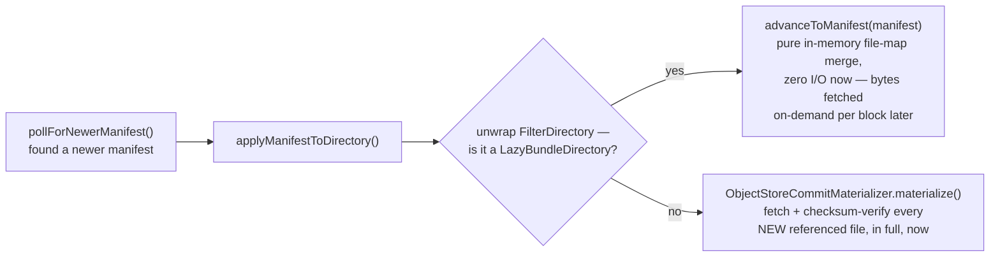
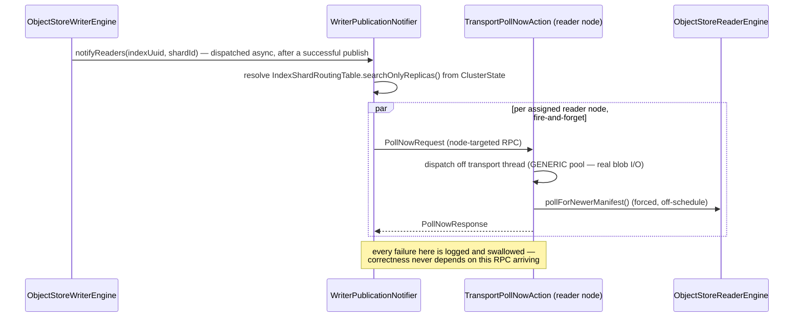

`ObjectStoreReaderEngine extends ReadOnlyEngine` — it reuses `ReadOnlyEngine` wholesale for search, get, and segment listing, and adds exactly: materializing manifest files into the store directory, reporting into the directory tier, and advancing the manifest generation as new commits appear. The engine's own class javadoc puts the design intent plainly: once `ObjectStoreCommitMaterializer` has populated the directory with a manifest's files, that directory holds an ordinary valid Lucene commit, and `ReadOnlyEngine` already implements everything else a read-only shard needs.

## Two scheduled tasks, one core method

The reader engine runs exactly two jobs on a timer: staying discoverable, and noticing new data. Only the second one does any real work.

- `directoryRefreshTask` — every 20s (`DIRECTORY_ENTRY_TTL_MILLIS/3`), reports this shard's presence into `ShardDirectory` (a discoverability hint only — see [Coordination](/design/coordination/)).
- `manifestPollTask` — every 5s (`MANIFEST_POLL_INTERVAL`), calls `pollForNewerManifest()`.

`pollForNewerManifest()` is the single most important method in this class, and it's `synchronized` because three independent callers can reach it concurrently: the background poll scheduler, `waitForGeneration`'s on-demand polling, and a forced `pollNow()` dispatched from a push notification. This is a compound read-check-apply-write sequence, not an atomic field update, so the method-level lock is load-bearing, not defensive boilerplate.

```java
synchronized void pollForNewerManifest() {
    Optional<ShardHead> head = shardStateStore.get(indexUuid, shardId);
    if (head.isEmpty()) return;

    lastObservedLatestGeneration.set(head.get().latestManifestGeneration()); // update BEFORE the budget check
    if (head.get().latestManifestGeneration() <= currentManifestGeneration.get()) return; // already caught up

    if (admissionController != null && admissionController.isOverBudgetForRefresh()) return; // skip, retry next tick

    CommitManifest manifest = manifestStore.readManifest(head.get().primaryTerm(), head.get().latestManifestGeneration());
    applyManifestToDirectory(engineConfig.getStore().directory(), manifest, materializer);
    maybeRefresh("manifest-generation-advance"); // Lucene DirectoryReader.openIfChanged via ReferenceManager
    currentManifestGeneration.set(manifest.generation());
    currentPrimaryTerm.set(head.get().primaryTerm());
}
```

`lastObservedLatestGeneration` is updated *before* the admission-budget check specifically so a reader that's deliberately throttling its own refresh rate still reports an accurate lag signal — a throttled reader shouldn't also look artificially caught-up to autoscaling.

## Lazy vs. eager materialization



`ObjectStoreCommitMaterializer.materialize` is careful to be idempotent and incremental: it lists the target directory's current contents, skips files already present, and only fetches genuinely new files — two consecutive manifests routinely share most of their segment files unchanged, so this is not "re-download everything on every generation."

The eager path is the default; the lazy path (`LazyBundleDirectory`, wired in via `index.serverless_storage.lazy_directory.enabled`) resolves file bytes on read through a block cache instead, trading first-query latency for not paying full-bundle download cost on every manifest advance — see the [Configuration](/configuration/) page's `lazy_directory.*` settings.

## Notification: optimization only, never correctness



If every notification is dropped — network partition, a reader node briefly unavailable, anything — correctness is unaffected: the 5-second background poll is the backstop, and `waitForGeneration` provides a bounded on-demand path for callers that need a specific generation now.

## Read-your-writes: `waitForGeneration`

A caller that just wrote through the writer and needs proof a specific reader has caught up can't wait out the passive 5-second poll schedule; it needs to ask and get a bounded answer now.

```java
void waitForGeneration(long minGeneration, TimeValue timeout, ActionListener<Boolean> listener) {
    // repeated checks dispatched via engineConfig.getThreadPool().schedule(...),
    // NOT Thread.sleep — blocking a GENERIC worker for the whole wait once starved
    // this plugin's other periodic tasks sharing that pool, per an earlier regression.
    // Each check: force pollForNewerManifest(), then compare currentManifestGeneration
    // against minGeneration. Resolves true/false; never fails outright.
}
```

This is what backs the plugin's `_wait_for_generation` REST endpoint (see [REST API Surface](/design/rest-api/)) — a caller that just wrote through the writer and needs to confirm a specific reader has caught up polls actively rather than trusting the passive 5-second schedule to have already run.
