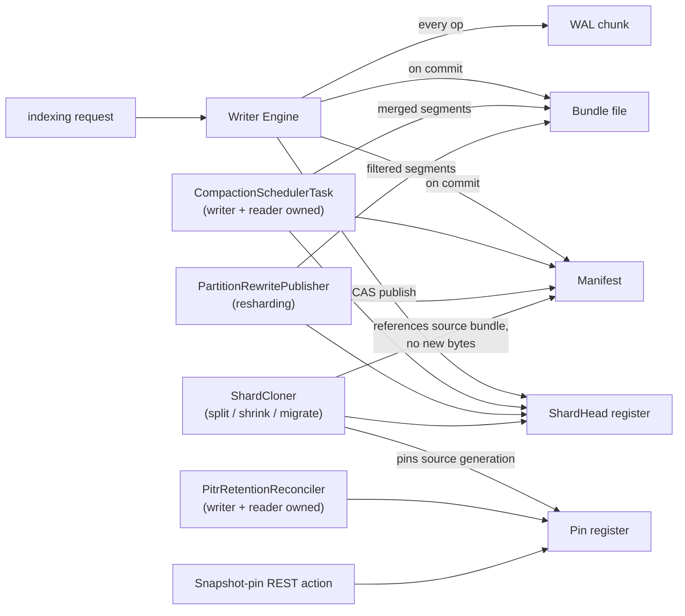

The [Architecture](/design/architecture/) page's core diagram shows one box labeled "remote object store." This page opens that box: exactly what's stored there, which component writes it, what triggers an update, and when and how each thing gets merged or deleted. Every read and write against it is a real network call with real cost, unlike a local disk access, which is why the concrete optimizations that keep API call count and size down matter as much as the data model itself.

## Data inventory

Everything in the remote store is one of two shapes: a small **register** (mutated via compare-and-swap, read frequently, cheap) or a large **blob** (written once, never mutated in place, read many times). See [Coordination & Consistency](/design/coordination/) for why that split is load-bearing, not incidental.

| Object | Shape | Written by | Contents | Typical size |
|---|---|---|---|---|
| `ShardHead` register | register (CAS) | writer engine (publish, lease renewal), compactor, cloner, migrator | `primaryTerm`, `leaseTerm`, lease holder/expiry, latest manifest generation | tens of bytes |
| Pin register | register (CAS) | `DurablePinRegistry` — PITR reconciler, snapshot-pin REST action, `ShardCloner` | set of `(pinId → manifest generation)` entries for one shard | hundreds of bytes to a few KB |
| Chunk-sequence register | register (CAS) | `WalChunkService.claimNextChunkSequence` | one monotonically increasing counter, cluster-wide per WAL container | tens of bytes |
| Manifest | blob, write-once | `ObjectStoreCommitPublisher.publishCommit` (writer engine, compactor, partition rewrite, clone, migration) | `(primaryTerm, generation)`, the file list for one Lucene commit (`FileReference`s into a bundle), `maxSeqNo`, `WalPosition`, doc counts, quiescent flag | a few KB, scales with segment count |
| Bundle file | blob, write-once | `BlobContainerBundleStore.writeBundle`, called from the same places as manifests | every Lucene segment file for one commit, packed into a single blob | MBs to low GBs |
| WAL chunk | blob, write-once | `WalChunkService.flush` / `WalBatchingProcessor`'s drain | a batch of `WalRecord`s (raw translog operations) appended since the last chunk | tens of KB to a few MB, size-tunable |

Every blob is encrypted independently in fixed 64 KiB blocks when encryption is configured (see [Security & Compaction](/design/security-compaction/)); every register is left in plaintext, since it never carries document data.

## Where each object comes from

Bundle files have exactly two producers: the writer engine packaging a fresh commit, and anything that re-packages segments (compaction, partition rewrite) — every other operation that creates a manifest (clone, split, shrink, migration) *references* an existing bundle rather than writing new segment bytes at all. That's the zero-copy property [Resharding](/design/resharding/) relies on.

## Lifecycle: when each thing updates, merges, or gets deleted

| Object | Created | Updated | Merged | Deleted |
|---|---|---|---|---|
| `ShardHead` | first lease acquisition (put-if-absent) | every publish (generation++) and every lease renewal — always via CAS, never in place without a version check | — (a register is never "merged," only replaced) | never explicitly; it's a fixed one-per-shard register that outlives the shard's own lifecycle bookkeeping |
| Pin register | first pin added for a shard | `addPin`/`removePin`/`replacePin`, each a read-modify-CAS-retry cycle | — | the register itself persists empty; individual pin entries are removed by `PitrRetentionReconciler` (window expiry) or the snapshot-release REST action |
| Chunk-sequence register | first WAL chunk ever claimed for a container | every `claimNextChunkSequence` call, CAS-incremented | — | never |
| Manifest | every commit, compaction rebase, partition rewrite, clone, or migration | never — manifests are write-once and immutable by design; a "new" commit is always a new `(primaryTerm, generation)` manifest, not an edit | conceptually via compaction (many small segments' worth of manifest history collapse forward into one denser manifest going forward), but the old manifest objects themselves aren't touched | [`GcSchedulerTask`](/design/gc-retention/) sweep, once superseded, past the retention window, and unpinned |
| Bundle file | alongside its manifest, by the writer engine, compactor, or partition rewriter | never — same write-once property as manifests | compaction and partition rewrite both produce a *new* bundle from old segments; they don't edit an existing bundle | GC sweep, once no *retained* manifest references it anymore (`BundleReferenceCounter`), and continuously orphaned for the full retention window |
| WAL chunk | every flush/batch drain while WAL mirroring is enabled | never | never | `WalGcSchedulerTask`, once every registered shard's `WalPosition` durability watermark has moved past that chunk |

The throughline: **registers get overwritten in place (via CAS), blobs never do.** A manifest or bundle is either the current one, a still-retained-for-a-reason old one, or gone — there's no third "being edited" state to reason about, which is a large part of why the CAS-plus-immutable-blob design is safe under concurrency in the first place.

## At rest vs. in transit

**At rest**, everything above is exactly what a `list-objects` call against the backing bucket/container would show — no hidden staging area, no write-ahead buffer inside the object store itself (the WAL chunk *is* the write-ahead buffer, and it lives in the same object store as everything else, just in the "objects" shape rather than "registers").

**In transit**, three things matter:

- **Ranged reads.** A reader materializing or lazily fetching a bundle rarely needs the whole blob — `ObjectStoreCommitMaterializer` and `LazyBundleDirectory` both fetch only the byte ranges (`BundleFileEntry.offset`/`length`) a specific file needs, via the backend's native ranged-GET support, the same mechanism that makes ranged decryption possible (see [Security & Compaction](/design/security-compaction/)).
- **Batched writes.** WAL records are batched into one PUT per chunk rather than one PUT per operation (see the optimization section below) — the network payload for a chunk is many operations concatenated, not one call per write.
- **No cross-object transactions.** Every write above is a single PUT or a single CAS call; nothing in this plugin holds a multi-object transaction open against the object store, because most backends don't offer one. This is exactly why manifest-then-bundle ordering, pin-before-read ordering, and bundles-before-manifests-on-delete ordering all matter — see [Coordination & Consistency](/design/coordination/) — each is a manually-sequenced substitute for a transaction the object store can't provide.

## Reducing object-store API cost

Every one of these exists specifically because object-store requests (and, on most backends, request *count* even more than bytes transferred) are the dominant cost and latency source in this architecture. None of them change correctness — each is purely an optimization layered on top of a design that's already correct without it.

- **Segment bundling.** Packing an entire commit's Lucene files into one blob (`format/`) means one PUT and, later, one or a few ranged GETs per commit instead of one API call per Lucene file. A commit with dozens of segment files becomes one bundle object.
- **WAL group-commit batching** (`serverless_storage.wal_flush.batching.enabled`, off by default — see [Core Changes](/core-changes/) for why the default stays off even though the underlying mechanism is safe). When enabled, many concurrent writes drain into a single WAL chunk PUT via `WalBatchingProcessor`, instead of one PUT per write under the legacy synchronous path.
- **Publication rate limiting** (`serverless_storage.publication_rate_limit`). Caps how often the writer engine will actually publish a new manifest generation in response to refresh-triggered commits, so a burst of small refreshes doesn't turn into a burst of manifest+bundle PUTs.
- **Local-disk ciphertext cache** (`LocalDiskCachingBundleStore`, sized via `serverless_storage.bundle_cache_size`). A reader that already has a bundle's bytes on local disk never re-fetches them — repeat reads of the same recent segments (the common case for a reader serving many queries) hit disk, not the network.
- **Node-wide in-memory plaintext cache** (`InMemoryPlaintextBundleCache`). Sits in front of the disk cache specifically for the encrypted-at-rest case: it holds decrypted bytes so a hot file read by many concurrent queries pays the decrypt cost once, not once per query — this doesn't reduce object-store calls directly, but it's the companion optimization that makes the disk-cache layer worth having at all when encryption is on.
- **Lazy, per-file, per-block fetch** (`index.serverless_storage.lazy_directory.enabled`, see [Reader Engine & Materialization](/design/reader-engine/)). Instead of eagerly downloading every file in a newly-published manifest, a reader fetches only the specific byte blocks a query actually touches, deferring (and often entirely avoiding) the GET for files or file regions nothing ever reads.
- **Incremental materialization.** `ObjectStoreCommitMaterializer.materialize` skips any file already present locally under the same name — since consecutive manifest generations usually share most segment files unchanged, a manifest advance typically fetches only the small delta, not the whole commit's file set again.
- **Manifest-existence idempotency check.** `ObjectStoreCommitPublisher.publishCommit` checks whether a manifest already exists at the target generation before doing any packaging work, so a CAS-retry loop that lost a race doesn't also redo an expensive bundle upload it doesn't need — see the publish retry loop on [Coordination & Consistency](/design/coordination/).
- **Push notification to cut polling latency, not polling itself.** Readers already poll on a fixed schedule regardless (correctness never depends on the push arriving — see [Reader Engine & Materialization](/design/reader-engine/)), so notification doesn't reduce request count; it only lets a reader skip waiting for its next scheduled poll tick when a fresher manifest already exists, trading a small, targeted RPC for lower staleness without tightening the poll interval (and therefore the steady-state request rate) globally.
- **Sustained-orphan window before GC deletes.** `GcSchedulerTask` requires a bundle to be continuously observed as orphaned for the full retention window before deleting it, rather than re-checking and retrying a delete on every sweep tick against a bundle that might legitimately still be settling — this avoids repeated wasted delete attempts against the same not-actually-ready-yet object.
- **Least-privilege containers, incidentally reducing wasted calls.** `RestrictingBlobContainer` denies delete calls outside GC's own container — a bug that would otherwise attempt (and fail) a delete from the writer or reader path is caught at the interface level before it ever reaches the network.
- **Request-count observability.** `RequestCountingBlobContainer`/`ObjectStoreRequestCounter`, surfaced via the `_object_store_request_stats` REST endpoint (see [REST API Surface](/design/rest-api/)), exists specifically so request volume regressions are visible and measurable rather than inferred from a cloud bill after the fact.
