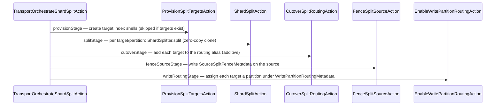

Resharding lets a shard grow into two (split) or two split siblings fold back into one (merge/shrink) without rewriting segment bytes at cutover time — the new shard's first manifest references the *same* underlying bundle files as the source, filtered to a hash range. See [Flows → Resharding Sequences](/flows/resharding-sequences/) for the full call-chain diagrams.

## Split

### Candidate detection and hysteresis

A shard doesn't split the instant it crosses a threshold — splitting is expensive to reverse, so a candidate has to sustain load first, not just spike on one busy tick. `InPlaceSplitTriggerCoordinator` consumes `ShardSplitCandidatesAction` output and issues real `InPlaceSplitShardAction` calls against core. Before acting on a candidate it requires **N consecutive ticks** flagged as a candidate (write-rate or size threshold), via a shared `SustainedCandidateTracker<T>` utility — the same hysteresis mechanism used verbatim by the merge coordinator (keyed by parent shard id) and the scale-up coordinator (keyed by index name), just with different keys and thresholds. Sustained candidates are sorted busiest-first and handed a per-tick budget (`maxSplitsPerTick`).

### Core mechanism (not this plugin)

Before any cloning happens, the source shard needs a manifest that reflects every acknowledged write, not a stale one. `TransportInPlaceSplitShardAction` (in `server/`, not `plugins/serverless-storage`) first issues a whole-index `FlushRequest` — there's no shard-scoped flush variant, so the whole index is flushed, coarser than ideal but simple — ensuring the clone step below sees every acknowledged write in the parent's latest published manifest generation. It then calls `MetadataInPlaceSplitShardService.split(...)`, which durably records split-in-progress state in core's `SplitShardsMetadata` (see [Core Changes](/core-changes/) for what was added to core to make this reachable at all).

### Zero-copy clone: `ShardCloner` → `ShardSplitter`

`ShardCloner.clone(...)` is the shared zero-copy primitive (also used by manual clone and, differently, by migration):

1. **Pin the source's current generation before reading its manifest** — the pin-before-read ordering explained on [Coordination](/design/coordination/), formally verified in `formal/CloneGc.tla`.
2. Write `CloneLineage` to the target, before the head CAS — so a later `deleteClone` can always find the pin to release.
3. Write the target's `CommitManifest` referencing the *same* segment files as the source.
4. An optional `beforeActivation` hook runs before the target becomes visible.
5. `ShardStateStore.compareAndSet` publishes the target's head, put-if-absent.

`ShardSplitter.split(...)` uses step 4's hook to durably write a `ShardPartitionDescriptor` (partition index + count) *before* the target's head CAS succeeds — closing a documented TOCTOU where an engine open landing between the CAS and the descriptor write would cache "no filter" forever, silently serving unpartitioned data.

At query time, a split target's live engine applies `PartitionFilteringDirectoryReader`, keyed by that descriptor, giving it only its own logical slice of the shared pre-split segments — logical partitioning first, physical rewrite later (below).

### Orchestrated flow: provision → split → cutover → fence → write-routing

`TransportOrchestrateShardSplitAction` composes the whole flow as a resumable sequence of ordinary `Client#execute` calls — each stage treats "already done" as success, so retrying the whole orchestration after a partial failure is safe:

A documented, acknowledged gap: fencing happens at the **cutover** stage, not at the clone point — writes acknowledged on the source between clone and fence are not protected by this flow (closed later, at cutover onward, not from the clone instant).

### Write-time enforcement: `WritePartitionRoutingActionFilter`

An `ActionFilter` with double duty, running just after the reactivation filter (`order = Integer.MIN_VALUE + 1`):

- **Rewrite**: a write against a write-routing alias gets its real target resolved via `Murmur3HashFunction.hash(id)` against the alias's partition count, then the request is rewritten to the resolved index before `chain.proceed`.
- **Fence**: a write landing directly against an already-assigned target (bypassing the alias) or against a fenced split source is rejected outright.

One subtlety worth documenting explicitly: core's `TransportSingleItemBulkWriteAction` wraps a single-item index request into a `BulkRequest` and re-dispatches it through the *same filter chain*, on the same thread. Without a re-entrancy guard, the filter's own rewrite on the first pass would look indistinguishable from a genuine direct-target write on the second pass, and the filter would self-reject its own rewritten request. The fix is a `ThreadContext`-scoped `IdentityHashMap`-backed marker set that records "this exact request object was already rewritten by us" — checked before the fence decision.

### Background physical rewrite

Logical filtering (`PartitionFilteringDirectoryReader`) is enough for correctness at cutover, but leaves each target still physically holding the full pre-split segment files. `PartitionRewriteSchedulerTask` → `PartitionRewritePublisher.rewrite()` cleans this up asynchronously, per target:

1. Materialize the current manifest, wrap in the same `PartitionFilteringDirectoryReader` the live engine already uses.
2. `IndexWriter.addIndexes` the filtered result into a fresh directory.
3. Publish as a **new manifest generation** via the ordinary `ObjectStoreCommitPublisher`/CAS path.
4. Only **after** the new manifest+head are durably published does it clear the `ShardPartitionDescriptor` — a crash before this line just means the next tick re-rewrites from scratch; no partial state is ever visible.

The old pre-rewrite bundle isn't explicitly deleted — it simply becomes unreferenced and falls to the ordinary [GC sweep](/design/gc-retention/). An already-open reader engine only picks up the rewritten generation on its next reopen, not instantaneously.

## Merge (shrink) — the reverse flow

### Candidate detection: three anti-flap mechanisms

Merge is the reverse of split, and a shard sitting right at the boundary between the two thresholds could flap back and forth without real guards against it. `InPlaceMergeTriggerCoordinator` consumes the same underlying signal as split, but pairwise: for every parent with exactly two children where `SplitShardsMetadata.canMergeChildrenBackToParent` is true, it sums both children's write-rate/size. Three separate guards prevent split/merge flapping on a shard sitting near the threshold:

1. Merge thresholds are set well below split thresholds (a large deliberate margin).
2. A higher `requiredConsecutiveTicks` than split's own tracker.
3. A hard `minCooldownMillis` floor checked *before* a pair ever enters the sustained-tick tracker at all, against `SplitShardsMetadata.getSplitCommitTimestamp(parentShardId)` — fails open (doesn't block) if the timestamp is unrecorded or the gate is disabled.

### Core mechanism and the fold-both-children requirement

`TransportInPlaceMergeShardAction` mirrors the split action's shape (whole-index flush, then `MetadataInPlaceMergeShardService.merge(...)`, which validates the parent really is a committed split parent with no further-split children before proceeding — an `IllegalArgumentException` here surfaces as a REST 400, not a 500).

The data-plane merge, `InPlaceSiblingMerger`, cannot simply revive the parent by taking one surviving child's state and dropping its range filter. That would only be correct at the instant a split commits, with zero post-split writes — once children serve independent traffic, each accepts its own disjoint writes into its own separate manifest, so neither child's local store is a full copy of the union anymore. The resolved approach folds **both** children together with a single `IndexWriter.addIndexes` over each child's own range-filtered, soft-deletes-aware reader (`SoftDeletesDirectoryReaderWrapper` + `InPlaceSplitFilteringDirectoryReader`): because hash routing partitions documents into disjoint ranges, each filtered reader contributes exactly that child's authoritative slice, with no double-counting and no cross-child version conflict to reconcile.

### A distinct manual primitive: `ShardShrinker`

`ShardShrinker` is a separate class from `InPlaceSiblingMerger`, for a genuinely different case: merging *arbitrary, independent* source shards (not necessarily a split sibling pair) into a brand-new target identity, via `IndexWriter.addIndexes` over full (unfiltered) documents, since arbitrary sources aren't range-partitioned. Its caller holds only a **transient** pin during materialization, released in a `finally` regardless of outcome — unlike `ShardSplitter`'s target, a `ShardShrinker` target needs no durable pin after activation, because its segments are entirely fresh and self-sufficient rather than referencing a source by clone.

## Shared patterns, not re-explained here

- `SustainedCandidateTracker<T>` hysteresis/budget mechanism — identical shape across split, merge, and scale-up.
- Pin-before-read ordering — identical shape across clone, split, shrink, and PITR. See [Coordination](/design/coordination/).
- `ShardStateStore.compareAndSet` activation — every "publish" in this whole subsystem (clone, split target, shrink target, migrated shard, partition rewrite) goes through the same CAS, and every one of them treats a lost race as a genuine error, not something to silently retry — except partition rewrite, which documents this as "unexpected for a split target" specifically because nothing else should be concurrently writing to it.
