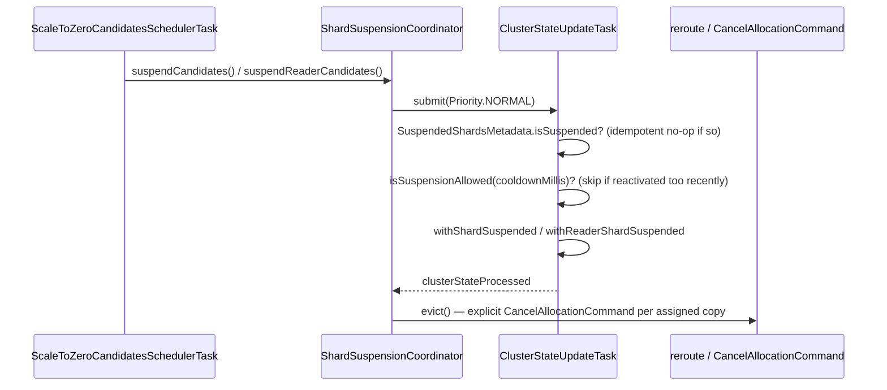
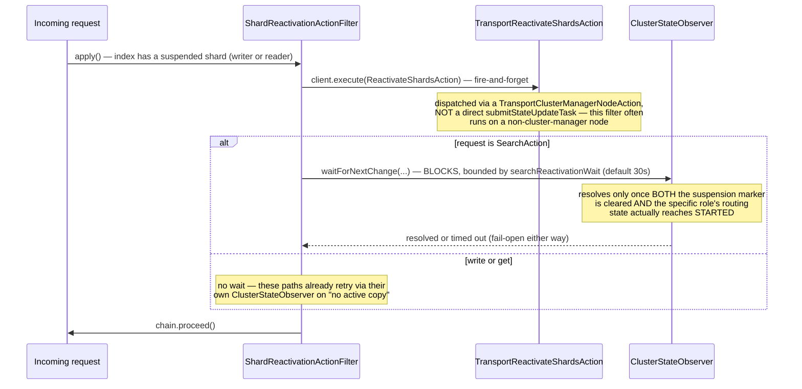

Writer and reader are tracked as **entirely independent** suspension tracks throughout this subsystem — a busy writer with an idle reader (or vice versa) is the common case, not an edge case, so every mechanism below is keyed separately per role.

## Scale-to-zero

### Candidate evaluation

Deciding what's idle enough to suspend needs a single, cluster-wide view, not N independent, possibly-disagreeing node-local ones. `ScaleToZeroCandidatesSchedulerTask` runs **only on the elected cluster-manager node**, re-checked fresh every tick (not cached), because `ScaleToZeroCandidatesAction` itself already fans out cluster-wide — running this on every node would just multiply identical work by the node count. It merges two independent idle signals per shard: writer idle time (`millisSinceLastActivity`) and reader freshness lag (`manifestGenerationLag`), each with its own `candidate()`/`readerCandidate()` boolean.

### Suspension

`ShardSuspensionCoordinator` is purely the "do the work" half — it has no eligibility logic of its own, only mechanism:

The explicit `CancelAllocationCommand` is not optional ceremony. A plain `canRemain=NO` from the allocation decider plus a bare reroute is documented as insufficient by itself: core's balancer only ever *moves* a shard that fails `canRemain` to a valid target — it never force-unassigns when no valid target exists, which is exactly the situation here (the decider also returns `NO` from `canAllocate` everywhere while suspended). This was caught by an integration test asserting routing state directly, not inferred from the decider's contract alone.

**Why unconditional eviction is safe even if the final flush fails**: a failed quiescent publish never advances the durability watermark, so local translog/Lucene data survives on the node, available for same-node reactivation replay. Eviction doesn't need to wait for — or verify — the final flush succeeded.

### Reactivation on incoming request

`ShardReactivationActionFilter` runs **absolute first** among this plugin's action filters (`order = Integer.MIN_VALUE`, one slot ahead of the write-partition-routing filter — reactivation must resolve before any write-routing decision is made). It operates at index granularity, not shard granularity, because the target shard hasn't been resolved yet at filter time.

The write/search asymmetry is deliberate, not an oversight: write and get requests already have their own retry-on-no-active-copy behavior elsewhere in core, so the filter just fires reactivation and moves on. `SearchAction` has no equivalent retry (`cluster.routing.search_replica.strict=true` by default), so for search specifically the filter itself blocks — but only up to `searchReactivationWait`, after which it proceeds anyway rather than hanging a request indefinitely. The wait condition checks the routing table reaching `STARTED` for the *specific role that was suspended*, not "any copy started" — an earlier version used the looser check and resolved too early, because a writer's primary routinely stays started while only the reader copy was suspended.

## Scale-up

`ScaleUpCandidatesSchedulerTask` is structurally identical to the scale-to-zero task (cluster-manager-only, its own independent schedule) but drives `ReaderReplicaExpansionCoordinator` instead. Candidates are sorted busiest-first by query rate, budgeted per tick, and — since `index.number_of_search_replicas` is an index-wide setting, not per-shard — multiple candidate shards belonging to the same index are deduplicated down to one settings update per tick. `expandIndex` is an ordinary `UpdateSettingsRequest` bumping the replica count by exactly one, capped at a configured maximum — a sanctioned settings-API path, not a bespoke cluster-state mutation like suspension uses.

There is no symmetric "reduce reader replica count" coordinator in this subsystem — the down direction is handled independently, by scale-to-zero suspending idle reader *copies*, not by reducing the configured replica count.

Everything on this page redistributes shard copies among nodes that already exist; nothing here adds or removes nodes. Scaling the fleet itself is a separate, proposed layer — see [Node Autoscaling (Proposal)](/design/node-autoscaling/).
