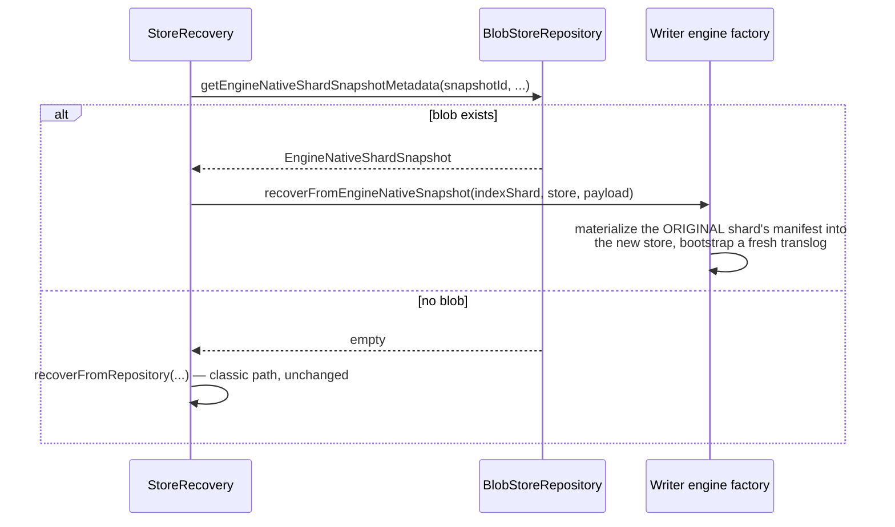

## Summary

`_snapshot`/`_restore` work against a serverless-storage index through core's own machinery: `PUT _snapshot/<repo>` followed by the ordinary `_snapshot`/`_restore` REST API, against any `fs`/`s3`/`azure`/`gcs`/`hdfs` repository. The mechanism is a new core extension point, engine-native snapshots: instead of `Repository#snapshotShard` copying a local Lucene commit's files, the writer engine hands back an opaque pointer to a manifest generation it has already durably published to the object store. The repository stores that pointer, a few hundred bytes, in place of segment files; restore reads it back and materializes from the original shard's remote bundles, not from a repository-local copy. No new `Repository`/`RepositoryPlugin` implementation, no new field on `SnapshotInfo`, and every touched core interface keeps working unmodified for every repository and engine that doesn't opt in. See [Interoperability](/interoperability/) for the current, shipped verdict, and [Snapshot & Restore Sequence](/flows/snapshot-restore-sequence/) for the full call chains.

## What this does not give you: an independent copy

The pointer never contains the data. Snapshotting to a repository different from wherever this plugin's own storage actually lives, say the plugin's data sits in S3 and `_snapshot` targets a GCS repository, does not copy segment bytes into GCS. GCS gets the few-hundred-byte pointer described above; the real bundles stay in S3, and restore always reads them from there, regardless of which repository the snapshot metadata was written to. If the original storage location becomes unreachable or the data is deleted, the snapshot in the other repository restores nothing: it never held an independent copy of anything.

This is not a bug or an oversight. It's the same property core's own remote-store shallow-copy snapshot already has when that mode is turned on, for the same reason: a pointer-based snapshot is fundamentally a reference to data that lives somewhere specific, not a self-contained backup. Anyone using this feature for cross-region or cross-provider disaster recovery needs to know that up front, because the failure mode (the snapshot repository is fine, but restore fails anyway because the *source* storage is gone) is easy to miss until it happens for real.

**Remote-backed storage gets a choice here; this plugin doesn't.** `index.remote_store.enabled` alone doesn't make snapshots pointer-based: a remote-store shard still keeps a complete local Lucene commit under normal operation, remote store is an additional durability/fast-recovery layer, not a replacement for local disk, so `Repository#snapshotShard`'s classic path can read that local commit and genuinely copy the bytes wherever `_snapshot` targets. Shallow copy for remote-backed storage is an explicit opt-in, gated on the repository setting `remote_store_index_shallow_copy` (`BlobStoreRepository.REMOTE_STORE_INDEX_SHALLOW_COPY`, default `false`); without it, a remote-store-enabled index snapshots the classic way. This plugin's writer engine has no equivalent local commit safe to copy the classic way, so there's no setting that restores that choice: `Engine#attemptEngineNativeSnapshot` never returns empty once configured, and every snapshot of a serverless-storage shard is pointer-based, unconditionally.

### A real byte-copying variant: considered, not built

Closing the independent-copy gap above would mean a snapshot mode that actually copies bundle bytes into the target repository instead of writing a pointer, with a server-side-copy optimization when the source storage and the target repository are the same provider (S3-to-S3, GCS-to-GCS), avoiding a full download-and-reupload through the node doing the snapshot.

Nothing in this codebase supports that today, and this isn't specific to this plugin. `BlobContainer` (`server/src/main/java/org/opensearch/common/blobstore/BlobContainer.java`) has no `copyBlob` method or anything like it: every write path takes an `InputStream` from the caller, "stream in, stream out" is the entire contract. None of the four object-store plugins (`repository-s3`, `repository-gcs`, `repository-azure`, `repository-hdfs`) use their provider's native server-side copy API anywhere, not even S3's `CopyObjectRequest` or GCS's `rewrite`. Snapshot `_clone`, the closest existing analog to "make this data available under a second reference," turns out to be pure metadata: `BlobStoreRepository.cloneShardSnapshot`/`cloneRemoteStoreIndexShardSnapshot` write a new metadata record pointing at the *same* underlying blobs and never read or write a single segment byte, and the clone request model doesn't even have a source/target repository pair, cloning is strictly within one repository. A real byte-copying variant would be new infrastructure from scratch, not an extension of something already half-built.

The design also runs into a real tension specific to this plugin's bundling, not a generic problem. Engine-native snapshots reference data by `(bundleName, offset, length)`, and a bundle blob routinely holds segments from several flushes, most unrelated to the one generation a given snapshot pins, that's the entire reason bundling exists (see [Remote Store Data Model](/design/remote-store-data-model/)). Copying whole bundle blobs 1:1 keeps the server-side-copy optimization but copies more than the snapshot needs, sometimes a lot more. Copying only the referenced byte ranges, repacked into new bundles in the target repository, gives a correctly-sized copy but requires reading and rewriting content, which forfeits the server-side-copy optimization entirely, and is materially the same operation `ObjectStoreCommitMaterializer` already performs on restore, just writing into a new bundle instead of a local Lucene directory. There's no way to get both minimal copy size and server-side copy once bundles are shared across generations; a real implementation would have to pick one, or offer both as a mode.

Scope-wise this is comparable to, arguably larger than, the whole engine-native feature described on this page: new `BlobContainer` SPI surface (a first for this codebase), a real repack-vs-bulk-copy design decision, and a new shard-snapshot metadata format for the copied case. Evaluated and deliberately not pursued as part of this work; left here for whoever picks it up next.

## Why full `Repository` SPI integration is out of scope

This was investigated once and deliberately deferred (see the plugin's `SnapshotPinAction`/`SnapshotRestoreAction` javadoc and the corresponding RFC status note). Implementing `RepositoryPlugin`/`Repository` from scratch, the way `repository-s3`/`repository-fs` do, is a large, separate mechanism, not an extension of anything the plugin already has. That conclusion still holds. Nothing below changes it.

## Why riding core's existing shallow-copy snapshot path doesn't work as-is

Core already has close to the right *shape*: for `index.remote_store.enabled` indices, a snapshot writes a small pointer object (`RemoteStoreShardShallowCopySnapshot`: primary term, commit generation, file names) instead of copying bytes, and restore re-fetches from the original remote store. Two things block reusing it directly:

- **Concrete-class coupling.** `RemoteSegmentStoreDirectory`/`RemoteSegmentStoreDirectoryFactory` are `final` and hard-cast directly inside `StoreRecovery.recoverFromSnapshotAndRemoteStore`. There's no interface a third-party engine implements to participate.
- **A structural mismatch with bundling.** The shallow-copy format assumes one Lucene file per remote-store blob. This plugin deliberately packs many files into shared bundle blobs, addressed by `(bundleName, offset, length)`, see [Remote Store Data Model](/design/remote-store-data-model/), specifically to cut object-store request count. Riding the existing path as-is would mean becoming remote-store-shaped and giving up that optimization.

## The seam: engine-native snapshots

Two new hooks, modeled directly on the `recoverMissingLocalStore`/`recoverInPlaceSplitLocalStore` family already documented on [Core Changes](/core-changes/): same shape, same additive/`default` guarantee that no existing `Engine`/`EngineFactory`/`Repository` implementation needs to change.

**Snapshot-creation side**, on `Engine` (not `EngineFactory`: only a live engine instance knows what it's actually durably published so far):

```java
// Engine.java
public Optional<EngineNativeSnapshotPointer> attemptEngineNativeSnapshot(SnapshotId snapshotId) throws EngineException {
    return Optional.empty();
}
```

`EngineNativeSnapshotPointer` carries an `engineId` tag alongside the opaque payload bytes. That tag is what lets a later snapshot delete find its way back to the right plugin's release logic, covered below. An earlier draft of this hook returned just `byte[]`; the tag turned out to be necessary once the delete-side hook needed to route to a specific `EngineFactory` without core ever inspecting the payload itself.

**Restore side**, the fourth member of the `EngineFactory` recovery-hook family, plus a fifth for delete:

```java
// EngineFactory.java
default boolean recoverFromEngineNativeSnapshot(IndexShard indexShard, Store store, byte[] snapshotPointer) throws IOException {
    return false;
}

default void releaseEngineNativeSnapshot(byte[] snapshotPointer) throws IOException {}
```

The release hook didn't appear in the earliest version of this design. It's genuinely required for a real v1: without it, a plugin either never pins (restore can silently fail against data GC already reclaimed) or pins forever (a permanent leak, one generation per snapshot ever taken).

## How a snapshot gets created

```mermaid
sequenceDiagram
    participant SSS as SnapshotShardsService
    participant Engine as Writer engine
    participant Repo as BlobStoreRepository

    SSS->>Engine: attemptEngineNativeSnapshot(snapshotId)
    Engine->>Engine: pin (primaryTerm, generation) under the snapshot's UUID
    Engine->>Engine: read + serialize that generation's manifest
    Engine-->>SSS: EngineNativeSnapshotPointer(engineId, payload)
    SSS->>Repo: snapshotEngineNative(..., pointer)
    Repo->>Repo: write engine-native-snap-&lt;uuid&gt;.dat
```

`SnapshotShardsService.snapshot()` tries this branch first, ahead of the existing classic and remote-store-shallow-copy branching, for every shard being snapshotted. `IndexShard.attemptEngineNativeSnapshot` mirrors `acquireLastIndexCommit`'s own shard-state check (must be `STARTED` or `CLOSED`) before dispatching to the live engine. For `ObjectStoreWriterEngine`, that dispatch either returns a pointer or throws: there's no silent empty result once the feature is configured on a shard, since an activated writer engine either has a manifest to pin or genuinely has nothing snapshottable yet, and the two cases shouldn't look the same to the caller.

## How restore materializes it back



Restore doesn't need a new flag on `SnapshotRecoverySource` to know which format a shard used. It just probes for an engine-native blob and falls back if nothing is there, the same kind of format probing `BlobStoreRepository.loadShardSnapshot` already does for the shallow-copy case. The materializing side resolves the *original* shard's blob container, not the restore target's: the manifest inside the payload carries its own `indexUuid`/`shardId`, and restoring after a delete always gets a fresh index UUID from core, so this is a real cross-index read every time, not a same-shard shortcut. It reuses `ServerlessStoragePlugin.blobContainerForDirectoryFactory`, the same resolver `ShardCloner` already uses for its own cross-index clone reads.

## The wire format

Three nested layers, each owned by a different side:

- **`EngineNativeShardSnapshot`** (core, `server/.../snapshots/blobstore/`) is the on-disk envelope `BlobStoreRepository` actually writes: snapshot name, `engineId`, timestamps, and a `payload` byte array, as XContent/JSON via the same `ChecksumBlobStoreFormat` mechanism (checksummed, optionally compressed, atomic write) that already backs the classic and shallow-copy shard-snapshot formats. Blob name: `engine-native-snap-<snapshot-uuid>.dat`.
- **`payload`** is exactly what `Engine#attemptEngineNativeSnapshot` returned, `EngineNativeSnapshotPointer#payload()`. Core reads this as an opaque `byte[]` and never looks inside it, base64-encoded automatically by the JSON layer above.
- **`EngineNativeSnapshotPayload`** (plugin, package-private) is what those bytes actually decode to: a pin ID (the snapshot's UUID) plus a `CommitManifest`, serialized `Writeable`-style rather than as XContent, since only this plugin's own code ever reads it back.

`CommitManifest` was already `Writeable`, carrying its own `indexUuid`, `shardId`, `primaryTerm`, `generation`, `localCheckpoint`, and file list, so it serializes directly as the payload's real content without inventing a new format. The pin ID is deliberately the snapshot's own UUID, not derived from `(primaryTerm, generation)`: two snapshots can reference the same generation, and pinning by generation alone would let releasing one un-pin a generation the other still needs.

## Keeping the pin honest under failure

The invariant this whole mechanism depends on: every pin `attemptEngineNativeSnapshot` registers must either end up referenced by a real, findable snapshot record, so a later delete can release it, or be released immediately if the attempt doesn't finish. `DurablePinRegistry` pins have no TTL, by design, so a pin that satisfies neither condition is orphaned forever, permanently blocking GC from reclaiming that generation, silent and invisible until someone notices the storage cost.

That invariant isn't automatic. An adversarial review pass, four independent agents each tracing a different failure class against the finished implementation, found two real windows where it didn't hold:

- Inside the engine itself: the pin lands, then either the manifest read or the payload serialization that follows it fails. Nothing downstream ever receives a pointer for a later delete to key a release off of. Fixed by wrapping each of those steps in its own try/catch and removing the just-added pin before rethrowing, in both `ObjectStoreCommitHeadPublisher.readLatestManifestWithPin` and `ObjectStoreWriterEngine.attemptEngineNativeSnapshot`.
- In `SnapshotShardsService`: the engine successfully returns a pointer (the pin is durable, the engine's side is done), but `Repository#snapshotEngineNative`'s write to the repository itself fails. Since no snapshot blob was ever written, the normal delete-triggered release path, which starts from a `blobExists` check, can never find this pin. Fixed by wrapping the repository call's listener: on failure, look up the pointer's `engineId` in `EngineNativeSnapshotReleasers` directly and release the pin before propagating the original error.

Both fixes are verified by a regression test confirmed to fail without the fix, not just pass with it: a test that only exercises the happy path can't tell you whether it would have caught the bug it's named for.

A narrower, related fix in the same pass: `getEngineNativeShardSnapshotMetadata`'s probe now runs on every classic-shaped restore, not only engine-native ones, so it has to behave the same way across every repository backend. Its `catch` clause originally caught only `IOException`, missing that some `BlobContainer` implementations (S3, GCS) throw an unchecked exception from `blobExists()`/read on a transient failure. Broadened to `catch (Exception e)`, matching the same broad catch `releaseEngineNativeSnapshotIfPresent` already used a few methods away in the same file.

### How this compares to core's own shallow-copy lock

Core's existing remote-store shallow-copy snapshot has the identical problem and solves it a different way: `RemoteStoreLockManager` writes a zero-byte blob named `<metadataFile>...<snapshotUUID>.v2_lock` into the remote store's own `lock_files` path, one lock file per (metadata generation, snapshot) pair. `SnapshotShardsService.snapshot()` acquires that lock (`IndexShard.acquireLockOnCommitData`) before writing the shallow-copy pointer, and the remote store's own segment GC (`RemoteSegmentStoreDirectory.deleteStaleSegments`) skips any generation with a matching lock file. On delete, the lock is released before the pointer blob is removed. If the pointer write fails after the lock was already acquired, core releases the lock it just took rather than leaking it, the exact bracket pattern this feature's own failure-handling fixes above converged on independently.

The mechanism is the same shape: pointer instead of byte-copy, a durable reference acquired before the write, released on delete or on write failure. What differs is the registry: core's default path uses one lock file per reference; this feature uses `DurablePinRegistry`, a pin record in a CAS-updated per-shard blob this plugin already had for PITR and cloning. Core actually has a second shallow-copy implementation, `shallow_snapshot_v2` (off by default), that pins a timestamp in `RemoteStorePinnedTimestampService` instead of writing lock files, a registry-based approach closer in shape to `DurablePinRegistry` than the default lock-file scheme is. Either way, core's version stays hard-wired to `RemoteSegmentStoreDirectory`; this feature needed the same protection available through a pluggable `Engine`/`EngineFactory` seam instead.

## What the plugin side reuses

The prediction that this would mostly be reuse, not new code, held up beyond the wire format above:

- `ObjectStoreCommitMaterializer`, the same class `recoverMissingLocalStore` already used, does the actual restore-side materialization. `EngineNativeSnapshotSupport.recoverFromEngineNativeSnapshot` is a thin wrapper around it plus translog bootstrap, the same three-call sequence `recoverMissingLocalStore`'s own implementation uses.
- `DurablePinRegistry` was already the pin mechanism this hook needed. Pinning `(primaryTerm, generation)` under the snapshot ID is the same operation `SnapshotPinAction` already performs by hand, just triggered from a new call site.

One thing wasn't a straight reuse: pinning has to happen *before* reading the manifest, not after, to avoid a race with a concurrent GC sweep. `ObjectStoreCommitHeadPublisher.readLatestManifestWithPin` is new, mirroring the pin-before-read ordering `ShardCloner.clone` already uses for the identical reason. The actual safety margin against that race comes from GC's own sweep re-checking pins immediately before it deletes anything, not from the pin write's ordering alone. Pin-before-read only maximizes the chance a pin lands before that recheck; a comparably narrow, pre-existing window between GC's recheck and its delete call is shared with `ShardCloner.clone` and not something this feature closes further.

## Design decisions this proposal left open

**Resolved: the timing mismatch on the capability flag.** The original concern was that core's shallow-copy decision is made ahead of time from a static repository setting, while whether an engine supports engine-native snapshots is naturally observed per-shard during the snapshot attempt. The two options considered, a new `EnginePlugin` dependency for `SnapshotsService` to ask ahead of time, or aggregating a per-shard observation at finalize time, both turned out to be more machinery than needed. Restore instead does a cheap probe at recovery time and falls back if nothing is there.

**Resolved: the delete/release hook.** `EngineFactory#releaseEngineNativeSnapshot` plus a node-level `EngineNativeSnapshotReleasers` registry (keyed by the `engineId` tag on `EngineNativeSnapshotPointer`) close this. `BlobStoreRepository`'s existing per-shard delete path calls it, best-effort, whenever a shard's removed snapshot IDs include an engine-native blob. See [Snapshot & Restore Sequence](/flows/snapshot-restore-sequence/) for the full delete-time call chain, and the failure-handling section above for the two other call sites that also had to reach it.

**Still open: cross-version/cross-cluster compatibility of the opaque pointer bytes.** The `recoverMissingLocalStore` family sidesteps this because it only ever runs same-cluster, same-plugin-version, local-node recovery. `_snapshot`/`_restore` exists specifically for cross-cluster/cross-version portability, and an opaque, engine-interpreted blob has no compatibility story today beyond the `engineId` string equality check. Restoring a snapshot taken by an older or newer version of the same plugin, or moving it to a different cluster running a different plugin build, is unaddressed.

**Still open: byte/file-count accounting is meaningless for an opaque blob.** An accepted, pre-existing wart the shallow-copy path already has (it zeroes these out too), not something this feature introduces, but worth knowing `_cat/snapshots` byte counts under-report the same way.

## What shipped

Nine core files: `Engine.java`, `EngineFactory.java`, two new small types (`EngineNativeSnapshotPointer`, `EngineNativeSnapshotReleasers`), `EngineNativeShardSnapshot` (a new `IndexShardSnapshot` implementation), `Repository.java`, `FilterRepository.java`, `BlobStoreRepository.java`, `IndexShard.java`, `StoreRecovery.java`, `SnapshotShardsService.java`. On the plugin side: two new files (`EngineNativeSnapshotPayload`, `EngineNativeSnapshotSupport`), plus `ObjectStoreCommitHeadPublisher`, `ObjectStoreWriterEngine`, `WriterEngineFactory`, and `ServerlessStoragePlugin` for wiring. The plugin's old `ServerlessStorageLegacySnapshotActionFilter`, which blanket-rejected `CreateSnapshotAction` against any serverless-storage index, is gone: it would otherwise block this feature from ever being reached.

Every new method on `Engine`/`EngineFactory`/`Repository` is either `default` or has a safe fallback. No existing implementation of any of the three needed to change to keep compiling and behaving identically, confirmed by exhaustive review across every implementer in the repository (production and test), and by the full existing test suites for all touched files passing unmodified. Verified end to end against a real `fs` repository: create an index, index a document, flush, snapshot, confirm via a direct repository read that the engine-native path was actually taken and not a silent classic fallback, close the index, restore, confirm the document comes back.
