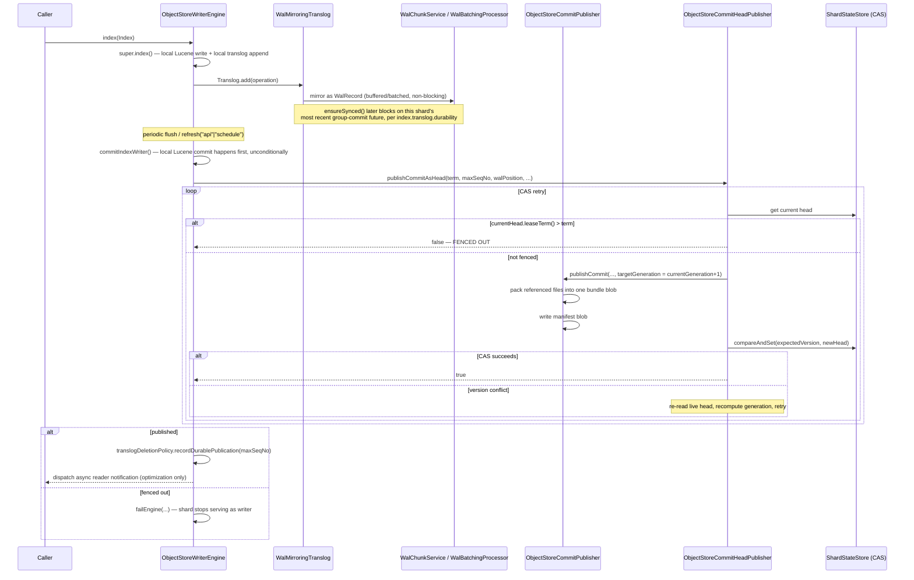

`ObjectStoreWriterEngine extends InternalEngine` — it reuses core's ordinary indexing/local-commit machinery wholesale, and adds exactly one thing on top: after each local Lucene commit, package the result and publish it as a manifest, fenced by the [ShardHead CAS](/design/coordination/) described on the Coordination page.

## Construction: synchronous, blocking lease acquisition

Unlike almost everything else in this plugin, engine construction is **not** fire-and-forget. The constructor calls `ObjectStoreCommitHeadPublisher.acquireOrRenewLease(...)` synchronously; if it returns `false` (this node was already fenced out — see Coordination), the constructor throws `EngineException` and closes the already-opened local store/translog before rethrowing. Because the throw happens inside the constructor, `close()` will never be called on this half-built object — cleanup has to happen inline, in the catch path, not deferred to the normal lifecycle.

A thread-local bridge pattern (`CONSTRUCTION_WAL_CHUNK_SERVICE`, `CONSTRUCTION_ACTIVATION_WAL_POSITION`, `CONSTRUCTION_ENCRYPTION_KEY_PROVIDER`) exists because `InternalEngine`'s own constructor calls overridden methods (`createTranslogManager`, `getTranslogDeletionPolicy`) *before* this subclass's field initializers have run — the thread-locals let those early callbacks see values that will become real fields moments later.

## Index request → durable → published



Two things worth being explicit about:

- **The local Lucene commit always happens first, unconditionally.** Publication is a step *after* the commit, not part of it. If publication is fenced out, the local commit still exists on disk (harmless — it's now orphaned data, eventually GC-eligible) but the engine is failed via `failEngine(...)`.
- **Idempotency lives in `ObjectStoreCommitPublisher`, not the head publisher.** `publishCommit` checks `manifestStore.manifestExists(primaryTerm, generation)` first and returns the existing manifest unchanged if so — this is what makes a CAS retry safe to re-publish under a new target generation without worrying about a previous attempt's partial writes.

```java
// ObjectStoreCommitPublisher.publishCommit — packaging step, not fencing-aware
if (manifestStore.manifestExists(primaryTerm, targetGeneration)) {
    return manifestStore.readManifest(primaryTerm, targetGeneration); // already done, return it
}
List<BundleFileContent> contents = readAllReferencedFiles(directory, segmentInfos);
SegmentBundle bundle = bundleStore.writeBundle(bundleName(indexUuid, shardId, primaryTerm, targetGeneration), contents);
CommitManifest manifest = new CommitManifest(indexUuid, shardId, primaryTerm, targetGeneration, /* ... */);
manifestStore.writeManifest(manifest);
return manifest;
```

Both writes (bundle, then manifest) are individually atomic-or-absent, but they're two separate blobs — a crash between them leaves an orphaned bundle (harmless, eventually GC-eligible) but never the reverse (a manifest referencing a bundle that doesn't exist).

## WAL: durability ahead of the next commit

The WAL exists to make a write durable *before* the next Lucene commit, without waiting for a full commit-and-publish cycle on every request. `WalMirroringTranslog` (a `LocalTranslog` subclass) mirrors every translog append into the WAL alongside the normal local write.

- **`WalChunkService`** — node-shared buffer plus chunk-sequence allocator. `claimNextChunkSequence()` uses the same CAS-retry shape as `ShardHead`, against a shared `"chunk-sequence"` register — a cluster-wide monotonic counter, deliberately not a locally cached `AtomicLong` (a prior bug used a local counter and broke under multiple nodes sharing one container). `append()` buffers in memory under a single `synchronized` block; if a shard's buffered bytes cross `perShardBudgetBytes`, it overflows into its own dedicated chunk — a fairness guard so one noisy shard can't starve others sharing the buffer.
- **`WalBatchingProcessor`** (opt-in via `serverless_storage.wal_flush.batching.enabled`) — group-commit built on core's `BufferedAsyncIOProcessor`, the same primitive `RemoteFsTranslog` already uses (see [Core Changes](/core-changes/) for why this replaced an earlier bespoke buffering scheme that had real deadlock bugs). Tracks `backlogBytes` for request-level 429 backpressure.
- **`WalShardRegistry`** — a grow-only registry of every shard that has ever used a given WAL container, consulted by `WalGcSchedulerTask` to compute a safe GC lower bound. A shard that's never registered is invisible to GC safety analysis — this is why the writer engine retries registration every lease-renewal tick until it succeeds once, rather than trying only at construction.

## Replay/recovery: two independent fencing bounds

WAL replay on shard activation has to answer: which WAL chunks contain operations this writer needs to replay, and which contain operations from a writer that has since been superseded? One bound alone isn't enough — this design is formally verified in `formal/WalReplayFencing.tla` ("FixedReplay").

**Bound 1 — term floor.** `minPrimaryTerm = currentTerm - 1`: admits records from at most one term back. Alone, this either wrongly excludes a predecessor's legitimately-durable-but-not-yet-manifested records (too aggressive) or admits records from a writer racing concurrently under an adjacent term (too permissive).

**Bound 2 — chunk-sequence cutoff (`activationWalPosition`).** Captured as the **last argument evaluated before `super(engineConfig)`** in the constructor — as early as this architecture can possibly capture it, ahead of local translog recovery and everything else the constructor does:

```java
// ObjectStoreWriterEngine.beginConstruction — snapshotted before super() runs
activationWalPosition = walChunkService == null
    ? -1L
    : walChunkService.currentChunkSequenceUpperBound(); // LIVE read, not cached
```

For a **live promotion** (an already-open engine whose primary term is bumped in place, not a fresh activation), `onPrimaryTermBumped(newPrimaryTerm)` re-snapshots `activationWalPosition` atomically with the term bump — closing the case the constructor-time snapshot alone can't cover.

```java
// WalReplayRecovery.replayOperations — the dual-bound filter
if (activationWalPosition < 0) return List.of();                              // WAL mirroring disabled
long fromChunkSequenceInclusive = lastDurableWalPosition == null ? 0 : lastDurableWalPosition.offset() + 1;
if (fromChunkSequenceInclusive >= activationWalPosition) return List.of();     // already fully caught up

for (long seq : listChunkSequencesInRange(container, fromChunkSequenceInclusive, activationWalPosition)) {
    List<WalRecord> records = filterByShardAndMinimumTerm(readRecords(readChunkBytes(container, seq)),
                                                            indexUuid, shardId, minPrimaryTerm);
    if (encryptionKeyProvider != null) records = decryptAll(records, encryptionKeyProvider);
    for (WalRecord r : records) operations.add(Translog.Operation.readOperation(StreamInput.wrap(r.payload())));
}
return operations; // ordered by chunk sequence, then within-chunk append order
```

The term filter alone can't distinguish "durable but not yet manifested" from "written by a concurrent racing writer under a nearby term" — the chunk-sequence upper bound is what actually fences out anything written *after this writer took over*, regardless of what term it claims. Neither bound is redundant; both are load-bearing.

The returned operations are applied by `IndexShard.openEngineAndRecoverFromTranslog()` through the same `applyTranslogOperation` path local translog recovery already uses — this plugin's own contribution stops at "fetch the right chunks, filter, decode, order," reusing core's replay application unchanged (this is exactly the `Engine.engineRecoveryOperations()` seam documented on [Core Changes](/core-changes/)).
