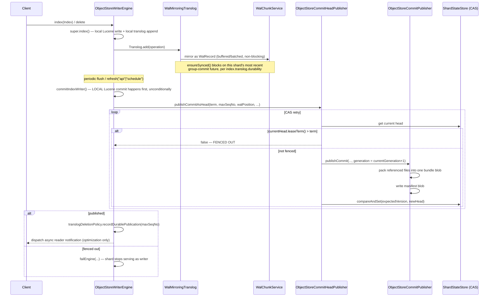
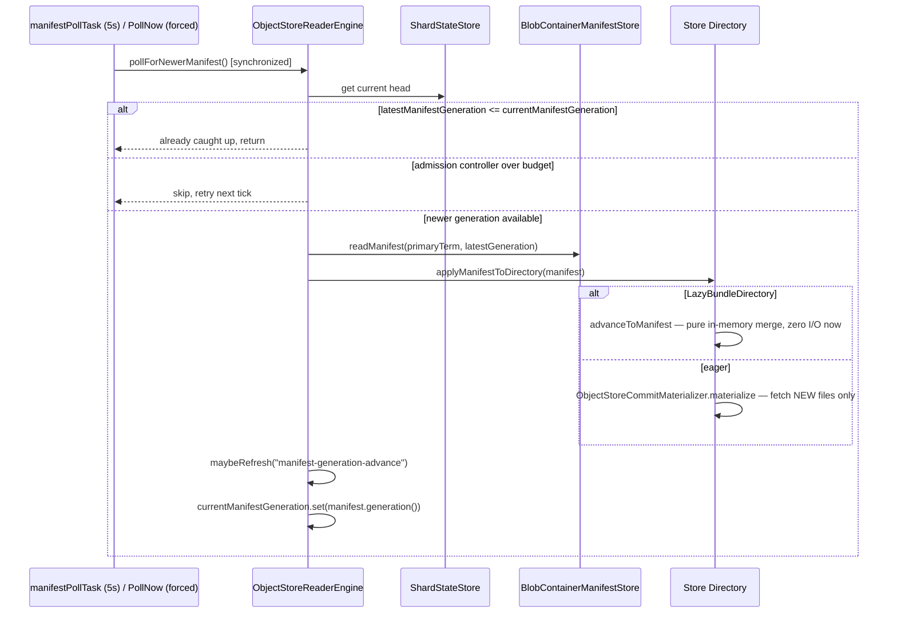
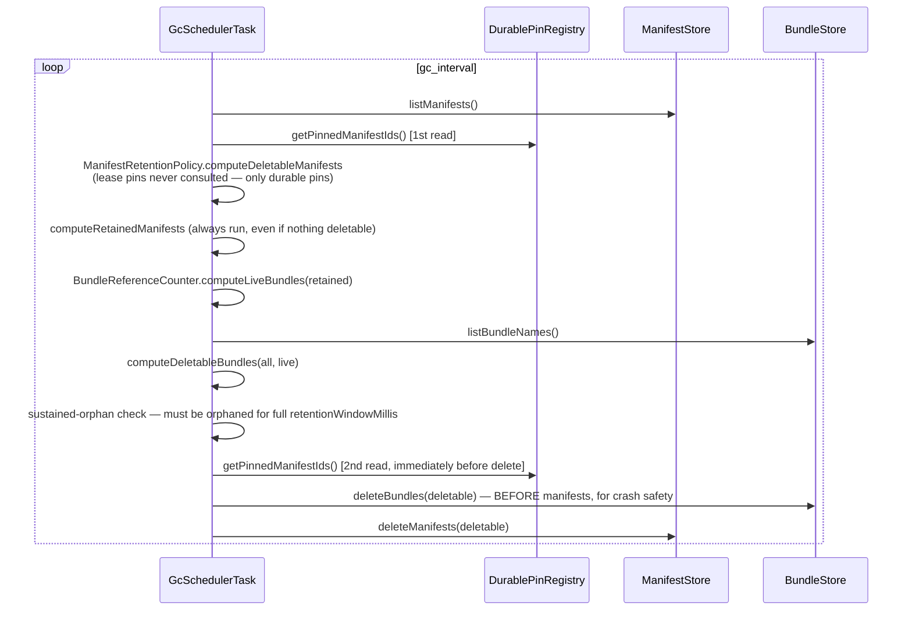

These three sequences are the everyday-operation backbone of the system. Each mechanism referenced here (CAS fencing, manifest polling, pin-before-read) has its own dedicated explanation on the linked Design pages.

## Write path

A single `index`/`delete` call, from the moment the client sends it to the moment it's either durably published or the shard gives up and fails itself out.

Full explanation: [Writer Engine & WAL](/design/writer-engine/). Fencing mechanism: [Coordination & Consistency](/design/coordination/).

## Read path

How a reader shard notices new data exists and pulls it in, without ever accepting a write of its own.

Full explanation, including the push-notification path and `waitForGeneration`: [Reader Engine & Materialization](/design/reader-engine/).

## GC / retention sweep

One sweep, deciding what's safe to delete and then deleting it, with a second pin check squeezed in immediately before the delete call to shrink the race window against a concurrent pin as far as it'll go.

PITR retention runs on its own separate schedule from **both** the writer and reader engine — full explanation: [GC, Retention & PITR](/design/gc-retention/).
