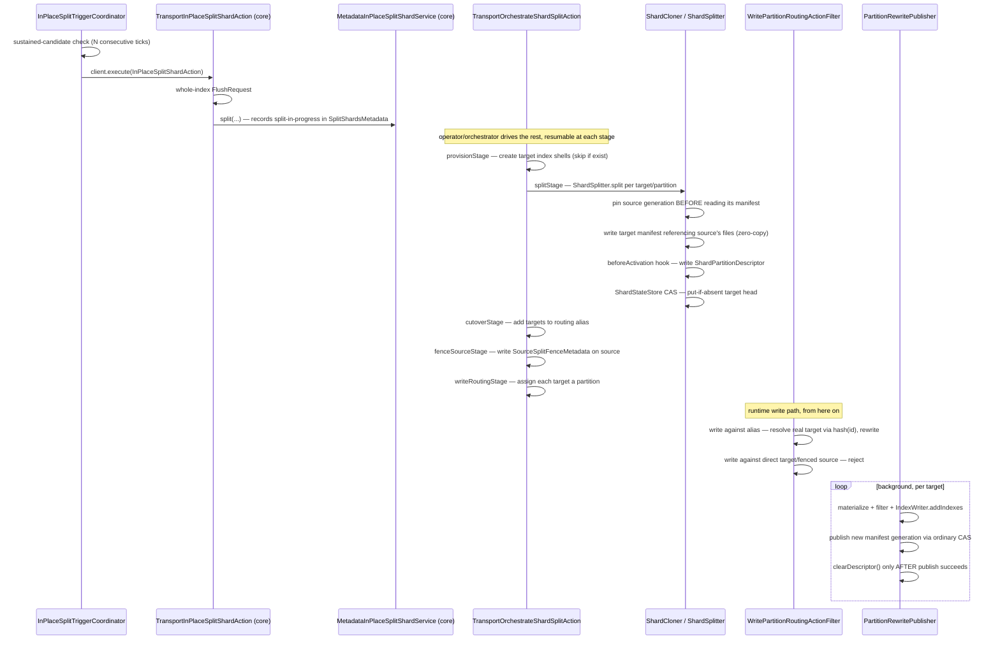
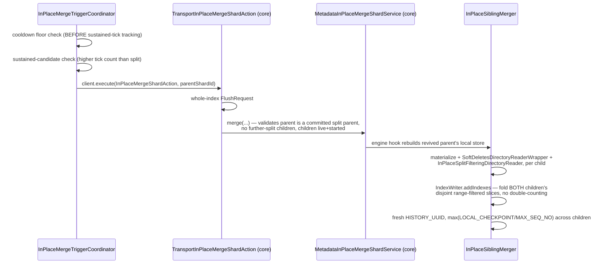

See [Resharding](/design/resharding/) for why each stage exists.

## Split, end-to-end

From the moment a candidate sustains long enough to trigger, through core's own split machinery, to the write path finally routing traffic at the new partitions.

## Merge, end-to-end

The reverse of split: folding two live children's data back into their revived parent, triggered far more conservatively than a split ever is.

Note the manual, non-automatic `ShardShrinker` primitive (arbitrary sources, full documents, transient pin) is a distinct code path from this automatic sibling-merge flow — see [Resharding](/design/resharding/#a-distinct-manual-primitive-shardshrinker).
