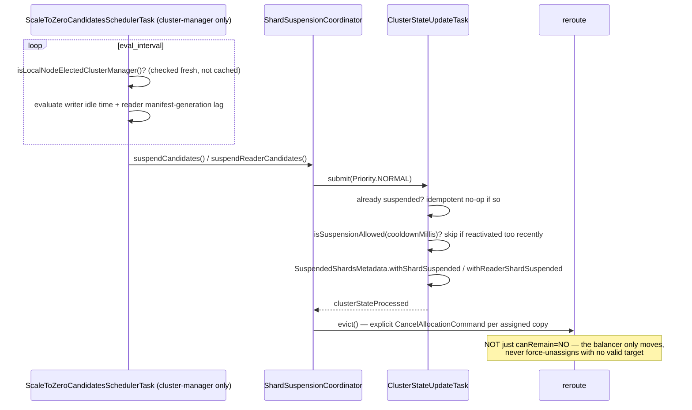
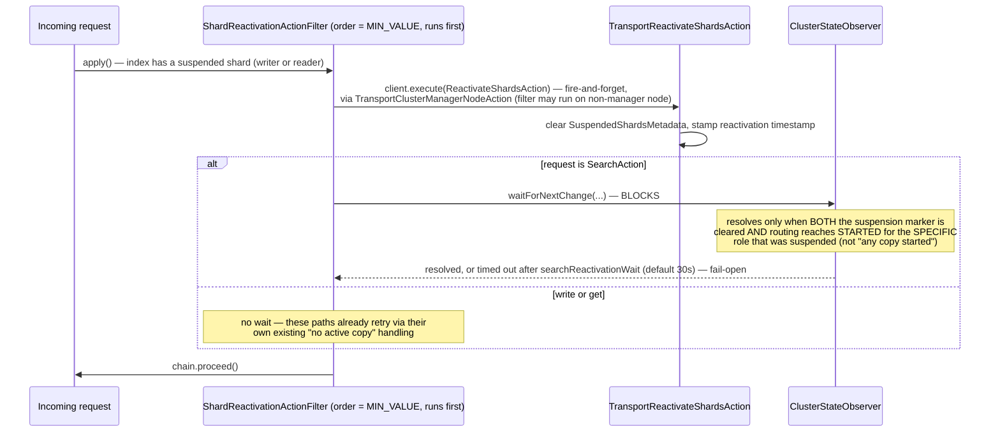

See [Scale-to-Zero & Scale-Up](/design/scale-to-zero-scale-up/) for why each step exists.

## Suspend

Idle candidates get evicted from the cluster, not just marked read-only, since core's balancer won't unassign a shard with nowhere to move it on its own.

Durability note: the final flush attempted before suspension is best-effort. Because the durability watermark only advances on a successful publish, a failed flush just means the next reactivation replays one commit further back via the WAL — eviction proceeds unconditionally either way, it never waits on flush success.

## Reactivate

An incoming request against a suspended shard triggers reactivation on the way in, but only search actually waits for it to finish before proceeding.

The `order = Integer.MIN_VALUE` placement matters: this filter runs one slot ahead of `WritePartitionRoutingActionFilter` (`Integer.MIN_VALUE + 1`, see [Resharding](/design/resharding/)) — reactivation must resolve before any write-partition routing/fencing decision is made on the same request.
