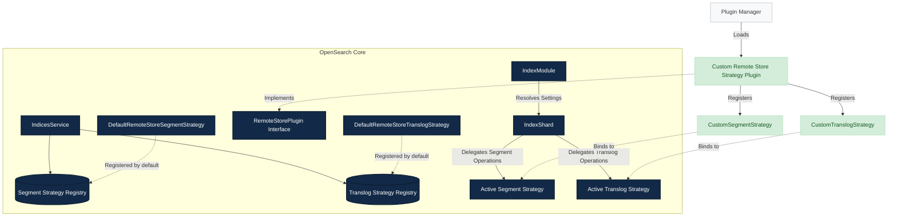

# RFC: Pluggable Remote Store Segment and Translog Strategies

## Introduction

This proposal introduces pluggable remote store strategies in OpenSearch by defining clean interface contracts for remote segment and translog storage. Decoupling the core database engine from specific physical layout and serialization formats allows custom optimization plugins to register alternative storage strategies (such as file bundling, compression, encryption, or custom metadata indexes) without modifications to the OpenSearch core.

## Motivation & Problem Statement

### Current Architecture

Currently, OpenSearch Remote Store (RBS) is tightly coupled to a 1-to-1 upload model:
1. **Segment Files**: Every Lucene segment file generated during a refresh is uploaded individually to the remote object store (e.g., AWS S3).
   * A single Lucene segment consists of multiple physical files. Under the Compound File Format, this includes at least three files per segment (`.si`, `.cfs`, `.cfe`). Under the Non-Compound File Format, it consists of ten or more files per segment (including `.si`, `.fnm`, `.fdx`, `.fdt`, `.tim`, `.tip`, `.doc`, `.pos`, `.pay`, `.nvd`, `.nvm`, `.dvd`, and `.dvm`).
2. **Translog Files**: Every translog checkpoint (`.ckp`) and data (`.tlog`) file is uploaded individually.

While correct and robust, this model generates a high volume of remote store API operations (primarily PUT and LIST), which represents a primary contributor to cloud object storage costs.

### Cost & Request Volume Estimates

In cloud object storage services like Amazon S3, API request pricing (e.g., $0.005 per 1,000 `PUT` and `LIST` requests) can quickly scale under high-throughput indexing:

#### 1. Remote Segment Upload Costs
* **Scenario**:
  * A cluster contains 200 active primary shards.
  * Indexing operations trigger a refresh every 1 second.
  * Each refresh creates an average of 5 segment files (accounting for compound format metadata/segments or non-compound field/index files).

* **API Call Volume**:
  * Segment uploads alone: `200 shards * 1 refresh/sec * 5 files = 1,000 PUT requests/second`.
  * Weekly total: `1,000 * 86,400 * 7 = 604,800,000 PUT requests`.
  * Monthly total: `~2.592 billion PUT requests`.

* **S3 Request Cost Estimate**:
  * Segment PUT costs: `2,592,000,000 * ($0.005 / 1000) = $12,960 / month`.

#### 2. Remote Translog Upload & Cleanup Costs
* **Translog Sync / Upload**:
  * For every translog sync/commit (which can occur multiple times per second under concurrent index requests), the engine must upload:
    1. The new `.tlog` translog data file (if not previously uploaded).
    2. The `.ckp` checkpoint file.
    3. A new metadata file (e.g., `translog_meta_...`) referencing the active translog generations.
  * This triggers 2 to 3 PUT requests per translog transfer per shard. If 200 shards sync translogs twice per second, it generates:
    `200 shards * 2 syncs/sec * 2.5 PUTs = 1,000 PUT requests/second` -> `~$12,960 / month` in translog PUT costs.
* **Listing & Cleanup (GC) Costs**:
  * To clean up stale generations and primary terms, the engine periodically scans files.
  * Finding stale translog metadata files requires listing the metadata directory (`LIST` request).
  * Discovering old primary terms requires listing folders in the translog data directory (`LIST` request).
  * Since `LIST` operations cost the same as `PUT` operations ($0.005 per 1,000 requests), regular listing checks across hundreds of shards scale request volume.

For workloads with high shard counts, short refresh intervals, or rapid translog updates, the API request costs can easily exceed the cost of the underlying storage capacity itself.

### The Extensibility Bottleneck

The core engine classes (such as `RemoteStoreUploaderService`, `RemoteSegmentStoreDirectory`, and `RemoteFsTranslog`) hardcode the file grouping, storage, and retrieval mechanics. Implementing optimizations to mitigate these API request costs requires intrusive modifications to core database code.

To address this, we propose introducing a pluggable remote store architecture where segment and translog storage strategies can be extended via plugins. This extensibility allows the community to implement alternative strategies for uploading and downloading with cost-optimization in mind, such as bundling segment files into a streaming archive format to reduce S3 `PUT` operations per segment upload, or aggregating translog snapshots at the node level across all active shards to minimize request overhead.

## Proposed Solution

We propose defining two key extension points in OpenSearch core (`server`) to abstract remote storage actions, exposing them through the existing plugin framework.



### 1. Strategy Interface Contracts

##### A. `RemoteStoreSegmentStrategy`
Abstracts remote segment storage layouts, transfers, and restoration. The strategy controls how segments are packaged, uploaded, and deleted, defining separate hooks for uploading data (`upload`) and uploading metadata (`uploadMetadata`). 
This separation allows strategies to determine whether to write separate metadata files (like the default strategy) or make `uploadMetadata` a complete no-op (like the tar strategy, which bundles metadata inline within the data archive as `index.bin`). 
By encapsulating metadata queries under a decoupled `MetadataReader`, the strategy can decide how to discover and retrieve metadata (for example, by utilizing block-range seeks to read metadata inline from a bundled archive rather than listing separate files on the remote store), keeping the OpenSearch core clean of format-specific logic.

```java
@ExperimentalApi
public interface RemoteStoreSegmentStrategy {

    void upload(RemoteSegmentStoreDirectory remoteDirectory, ShardId shardId, UploadContext context, UploadListener listener)
        throws IOException;

    void uploadMetadata(RemoteSegmentStoreDirectory remoteDirectory, ShardId shardId, MetadataUploadContext context) throws IOException;

    void deleteStaleSegments(RemoteSegmentStoreDirectory remoteDirectory, ShardId shardId, int minCommitsToKeep) throws IOException;

    void deleteFile(RemoteSegmentStoreDirectory remoteDirectory, ShardId shardId, String name) throws IOException;

    MetadataReader getMetadataReader(RemoteSegmentStoreDirectory remoteDirectory, ShardId shardId);

    @ExperimentalApi
    public static record UploadContext(Collection<SegmentFile> segmentFiles, Directory storeDirectory, ReplicationCheckpoint checkpoint,
        boolean isLowPriorityUpload, CryptoMetadata cryptoMetadata) {

        @ExperimentalApi
        public static record SegmentFile(String name, boolean toUpload) {
        }
    }

    @ExperimentalApi
    public interface UploadListener {
        void onUploadStart(String file);

        void onUploadSuccess(String file);

        void onUploadFailure(String file, Exception ex);

        void onAllUploadsSuccess();

        void onAllUploadsFailure(Exception ex);
    }

    @ExperimentalApi
    public static record MetadataUploadContext(Collection<String> activeSegmentFiles, CatalogSnapshot catalogSnapshot,
        Directory storeDirectory, long translogGeneration, ReplicationCheckpoint checkpoint, String nodeId, CheckedFunction<
            CatalogSnapshot,
            byte[],
            IOException> catalogSnapshotToCommitSerializer) {
    }

    @ExperimentalApi
    public interface MetadataReader {

        RemoteSegmentMetadata readMetadata() throws IOException;

        RemoteSegmentMetadata readMetadata(long primaryTerm, long generation) throws IOException;

        RemoteSegmentMetadata readMetadata(long timestamp) throws IOException;

        RemoteSegmentMetadata readMetadata(String filename) throws IOException;

        Map<String, RemoteSegmentMetadata> readLatestNMetadata(int count) throws IOException;

        String getMetadataFilename(long primaryTerm, long generation) throws IOException;
    }
}

```

#### B. `RemoteStoreTranslogStrategy`
Abstracts remote translog storage layouts, transfers, restoration, and cleanup. The strategy governs translog snapshot uploads, individual generation recovery, full-shard translog downloads, and garbage collection.

```java
@ExperimentalApi
public interface RemoteStoreTranslogStrategy {
    boolean transferSnapshot(
        ShardId shardId,
        TransferSnapshot transferSnapshot,
        TranslogTransferListener listener,
        CryptoMetadata cryptoMetadata
    ) throws IOException;

    boolean downloadTranslog(ShardId shardId, String primaryTerm, String generation, Path location) throws IOException;

    default boolean download(ShardId shardId, Path location, boolean seedRemote, long timestamp)
        throws IOException {
        return false;
    }
}
```

### 2. Plugin Extension Points

We introduce `RemoteStorePlugin` in `org.opensearch.plugins`, extending the capabilities of the plugin system to register custom strategies:

```java
@ExperimentalApi
public interface RemoteStorePlugin {

    /**
     * The {@link RemoteStoreSegmentStrategy} mappings for this plugin.
     */
    default Map<String, RemoteStoreSegmentStrategy> getRemoteStoreSegmentStrategies() {
        return Collections.emptyMap();
    }

    /**
     * The {@link RemoteStoreTranslogStrategy} mappings for this plugin.
     */
    default Map<String, RemoteStoreTranslogStrategy> getRemoteStoreTranslogStrategies() {
        return Collections.emptyMap();
    }
}
```

### 3. Default Strategy Implementations & Refactoring

To maintain backward compatibility, the current remote store upload and download logic is refactored into baseline implementations:
- `DefaultRemoteStoreSegmentStrategy`: Encapsulates the existing 1-to-1 upload mechanism for Lucene segment files during refreshes.
- `DefaultRemoteStoreTranslogStrategy`: Encapsulates the existing individual `.tlog`, `.ckp`, and metadata file snapshot upload, tracking, and recovery logic in `TranslogTransferManager`.

This refactoring isolates current behavior into discrete, self-contained classes. When no custom strategy is configured, the engine defaults to these implementations, ensuring a transparent transition for existing clusters.

### 4. Index-Level Configuration Settings

To allow users to select and configure strategies dynamically, we introduce two new index-level settings:
* `index.remote_store.segment.strategy`: Specifies the segment storage strategy to use for the index (default: `"default"`).
* `index.remote_store.translog.strategy`: Specifies the translog storage strategy to use for the index (default: `"default"`).

These settings are defined per index, permitting administrators to selectively enable specialized optimization strategies (such as compression, encryption, or bundling) on specific high-throughput indexes while leaving others on the default strategy.

### 5. Strategy Integration & Resolution Lifecycle

* **Registration & Bootstrap**: During node startup, `IndicesService` scans all loaded plugins, registers their provided strategies into a centralized strategy registry, and registers the built-in `"default"` strategies.
* **Shard Initialization**: During shard creation, the `IndexModule` and `IndexShard` resolve the configured strategy names from the index settings against the registry and instantiate the shard-level strategy hooks.
* **Execution Delegation**: Core write paths (such as `RemoteStoreUploaderService` for segment refreshes, and `RemoteFsTranslog` for translog syncing) retrieve the active strategy from the shard and delegate execution directly to the strategy interface methods.

### 6. Why Pluggable Strategies Can Completely Replace Default Behavior

Pluggable strategies can completely replace default remote store behaviors because the OpenSearch core has been decoupled from any specific storage format, file layout, metadata schema, or garbage collection model:

1. **Complete File Layout Autonomy**:
   * The core engine does not enforce a 1-to-1 mapping between local Lucene or translog files and S3 objects.
   * A custom strategy has full authority to write individual files, compress them, or pack multiple files into a single streamed `.tar` archive (as done in `TarSegmentUploadStrategy` and `TarTranslogUploadStrategy`).
   * Remote file names can contain layout directives (e.g. `bundle_uuid.tar#offset`) that the strategy's metadata reader parses to resolve locations.
2. **Metadata-Free S3 Layouts**:
   * Under the default strategy, the core uploads separate `.metadata` (segments) or `txlog_*` (translog) files to S3, which are read during recovery.
   * Under custom strategies, metadata files can be completely eliminated. The `rbs-tar` segment strategy writes a binary `index.bin` metadata block at the start of every tar file. When recovery is triggered, the strategy's metadata reader issues an S3 Range GET to read `index.bin` and construct the metadata mapping in-memory without accessing separate metadata files on S3.
3. **Decoupled Garbage Collection (GC)**:
   * The core's segment and translog deletion routines are delegated to the strategy interfaces.
   * For segments, the `rbs-tar` strategy intercepts deletion calls, checks dependencies across active metadata, and deletes S3 tar archives only when all constituent segments are inactive.
   * For translogs, since generations are never tracked as individually uploaded files inside the core's `fileTransferTracker` under the bundle layout, the core's default GC routine naturally becomes a NO-OP. Instead, translog GC is offloaded to a centralized master scheduler on the `NodeBundleRegistry`, which aggregates references from all shards and deletes stale bundles directly without listing S3.
4. **Custom Recovery Routing**:
   * Instead of hardcoded file-by-file downloads, recovery is delegated via `strategy.download(...)`.
   * A strategy can coordinate locations with the Master node via custom TCP transport actions (`GetTranslogLocationAction`) to download exact byte slices directly, bypassing the default recovery path.


## Dynamic Strategy Switching & Safety Considerations

Allowing strategy configuration settings (`index.remote_store.segment.strategy` and `index.remote_store.translog.strategy`) to be modified dynamically on live indexes introduces complexity, as a single index or shard may transition between different storage layouts. To guarantee data integrity and query availability, several key safety considerations must be addressed:

### 1. Coexistence of Multiple Layouts (Mixed-Strategy Support)

* **Segment Path**: A shard's remote store repository must support reading and cleaning up segment files uploaded under different strategies.
  - **Strategy Attribution in Metadata**: When a segment file is uploaded, the name of the strategy used for its upload is recorded in the core Lucene commit metadata file (e.g., `UploadedSegmentMetadata` written once per refresh).
  - **Decoupled Reads via Uploaded Metadata**: Lucene directory reads (`openInput`) are resolved by looking up `UploadedSegmentMetadata` from the catalog. Each strategy registers a subclass implementation of `UploadedSegmentMetadata` (such as `TarUploadedSegmentMetadata`) which overrides `openStream(position, length)` to perform range requests on S3 directly using offset and size details, keeping the core completely independent of offset-seeking or bundling layouts.
  - **Metadata-Free S3 Layout**: Because the metadata reader is decoupled, custom packaging strategies (like the tar strategy) can be completely self-contained on S3. The tar strategy puts `index.bin` as the first entry inside the `.tar` archive. During recovery or directory initialization, the strategy's `MetadataReader` performs an S3 Range GET to read `index.bin` from the start of the archive and build the file-to-offset metadata catalog, removing any need for separate metadata or coordinate files on S3.
* **Translog Path**: During peer recovery or primary restoration, a shard reconstructs translogs across a range of generations. If the strategy has been switched, this range will contain translog files written under different formats.
  - **Metadata-Attributed Restoration**: The metadata file uploaded for each translog snapshot (`TranslogTransferMetadata`) records the strategy type used for the transfer.
  - **Generation-by-Generation Recovery**: The recovery engine iterates through generations and delegates the download of each generation file to the strategy registered in its respective metadata file.
  - **Pluggable Translog GC / Muting S3 Lists**: Under the default strategy, translog garbage collection performs directory listings to delete individual generation files and old metadata files. Under custom strategies (like the tar strategy), because individual files are never tracked by the core as uploaded, the core's GC routine (`trimUnreferencedReaders(...)`) naturally bypasses the default remote S3 deletion code path. Garbage collection is instead offloaded to a centralized master-node scheduler on the `NodeBundleRegistry`, which directly deletes stale `.tar` bundles from S3 without any `LIST` operations, effectively muting redundant S3 list calls.


### 2. Thread Safety and Configuration Drift

* **Settings Snapshotting**: To prevent configuration drift mid-operation, the active strategy instance is snapshotted at the start of each lifecycle operation. For example, a segment refresh upload or translog sync operation uses the same strategy instance from start to finish, even if index settings are updated mid-transfer.
* **Write Barriers**: We ensure settings updates apply atomically at the boundaries of upload operations, preventing race conditions where concurrent threads attempt uploads under conflicting assumptions.

### 3. Settings Validation

* **Cluster-Wide Feature Validation**: When an index setting is updated dynamically, the cluster coordinator validates that the proposed strategy is registered and active on all nodes in the cluster before approving the settings change. This prevents shards from relocating to a node that lacks the plugin registering the strategy, which would cause initialization failures.

## Example Use Cases

Pluggable strategies enable several key remote storage patterns:

1. **File Bundling & Archiving**:
   * Groups all segment files from a single refresh batch, or translog snapshots across multiple local shards, into a single remote archive (e.g., using a custom streaming container format).
   * Reduces the total number of remote store `PUT` operations by **80% to 90%** by packing files, and uses Range GET block reads to resolve partial file requests.
2. **Compression and Encryption**:
   * Compresses file payloads (e.g., using LZ4 or ZSTD) and encrypts them using key management integrations before uploading.
   * Keeps storage size and network bandwidth low while ensuring data compliance without requiring the core engine to manage encryption keys.
3. **Optimized Metadata and GC**:
   * Uses centralized registries or customized directory index formats to track file versions and active references.
   * Eliminates the need to perform slow, expensive remote listing (`LIST`) operations during index garbage collection or shard initialization.

## Alternatives Considered

We evaluated several alternative designs and storage backends to address remote store costs and flexibility:

### 1. Hardcoding Optimizations directly in OpenSearch Core
* **Approach**: Implement specific archiving and bundling algorithms (like Tar or zip) directly into the core engine.
* **Concerns**: This significantly increases the complexity of the core engine codebase. Tying the core to a specific archive format or custom indexing registry limits future modifications and restricts maintainability, preventing teams from deploying specialized storage strategies.

### 2. Using Valkey (In-Memory Key-Value Store) for Translog Storage
* **Approach**: Offload translog snapshot storage to a fast, external Valkey cluster rather than S3.
* **Concerns**:
  - **Prohibitive Storage Cost**: Valkey stores data in memory (RAM or RAM-backed SSD). Storing high-volume translogs in RAM is orders of magnitude more expensive than S3 Standard storage, which is approximately $0.023 per GB-month.
  - **High Network Transfer Cost**: Replicating translog data on every sync/commit to an external Valkey cluster generates continuous inter-cluster network traffic, driving up data transfer fees.
  - **Durability Risks**: Although translogs are temporary data pruned after Lucene flushes, they are critical for recovery. Valkey's asynchronous replication and snapshots do not match S3's 99.999999999% (11 nines) durability guarantees, risking data loss during double-failure scenarios.
  - **Technical Complexity**: Adding a dependency on an external key-value cluster introduces extra client connections, connection pools, and failover states, increasing the system's operational failure surface.

### 3. Using Amazon EFS (Elastic File System) as a Shared Filesystem Blob Store
* **Approach**: Configure a shared network filesystem (like EFS) as a custom repository for translogs and segments.
* **Concerns**:
  - **High Storage Cost**: Amazon EFS storage is approximately $0.30 per GB-month, making it more than **10 times the cost** of S3 Standard storage (which is approximately $0.023 per GB-month).
  - **Throughput & IOPS Cost**: EFS charges heavily for throughput (provisioned or bursting), which can quickly become a cost bottleneck for write-heavy indexing workloads constantly flushing segments and syncing translogs.
  - **Durability Profile**: Shared network filesystems lack the automatic, geographically distributed multi-AZ replication profile built into S3 by default.
  - **Technical Complexity**: Mounting NFS/EFS across large distributed clusters introduces locking bottlenecks, mount-point reliability issues (e.g., hanging mounts during network partition events), and file system metadata performance spikes under high concurrent access.

### 4. Implementing Optimization at the custom BlobStore / Storage Gateway Layer
* **Approach**: Virtualize the remote storage using a custom BlobStore provider or a filesystem mount utility (e.g., S3FS) to intercept segment writes.
* **Concerns**:
  - **No Lifecycle or Transactional Context**: A generic storage driver or BlobStore provider only receives low-level file write and upload stream operations. Because it lacks database-level semantics (such as Lucene refresh boundaries or primary term checkpoints), it is extremely difficult for the storage layer to know *which* files belong to a single refresh batch and when it is safe to bundle them.
  - **Complex Shard Restoration**: During search, segment merges, or shard recovery, reading back files from a bundled layout requires virtualizing block reads. Implementing this at the low-level BlobStore layer without access to index directory mappings makes range offsets and metadata seeking highly complex and error-prone to reconstruct.
